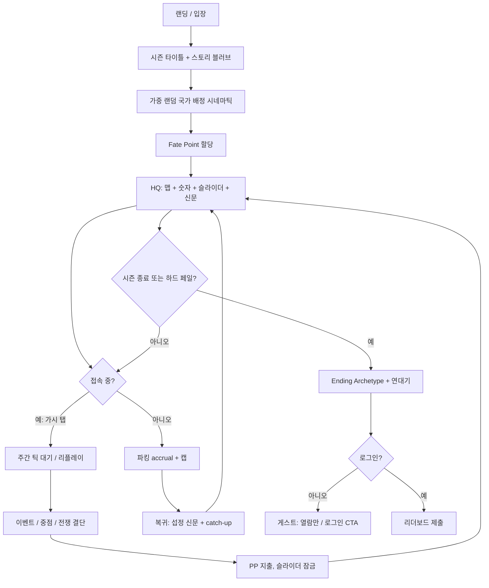
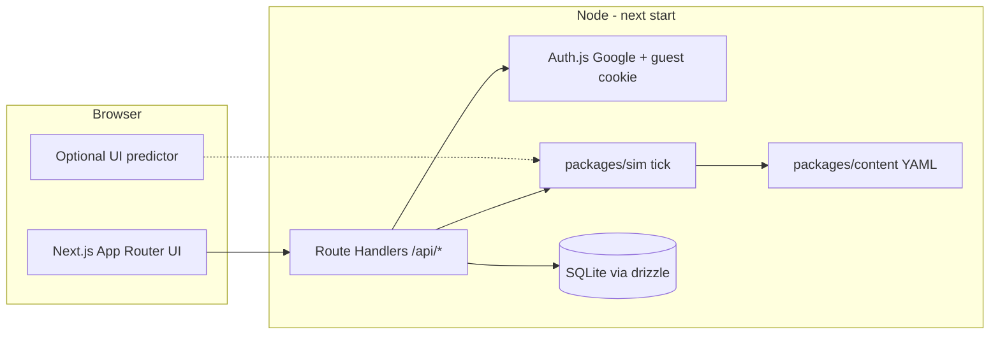
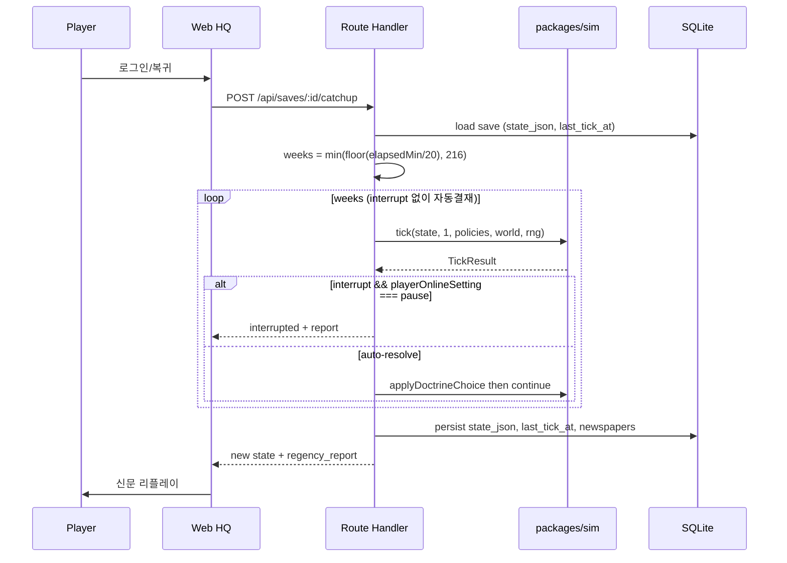
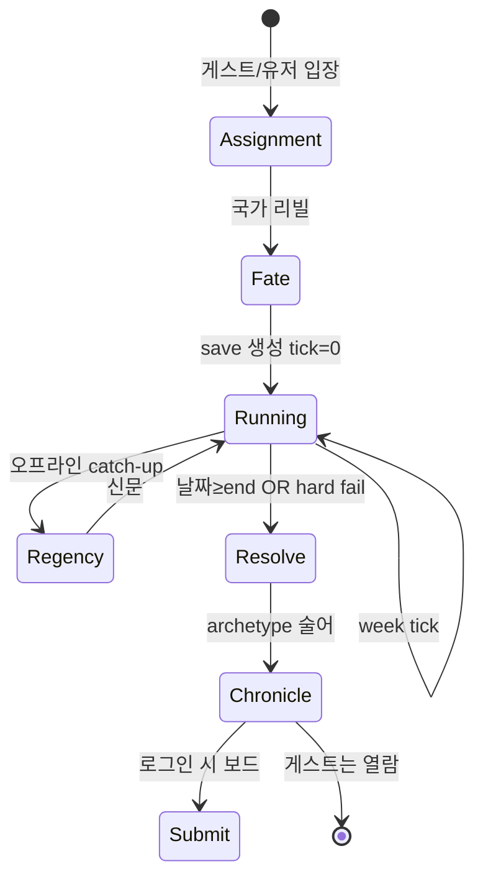
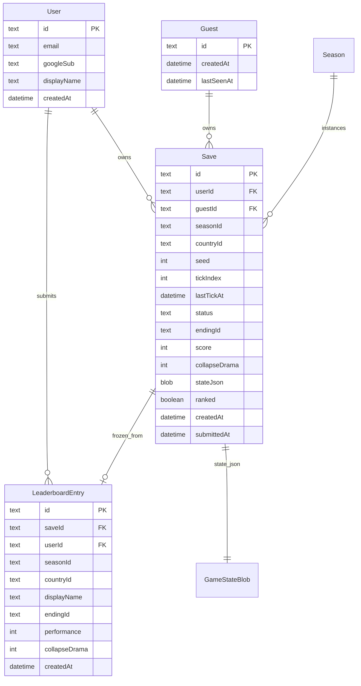

# SimulAI — Idle Nation 설계서

| 항목 | 값 |
|---|---|
| 문서 제목 | SimulAI Idle Nation Web Game Design |
| 제품명 | SimulAI |
| 저자 | SimulAI design |
| 날짜 | 2026-08-27 |
| 상태 | Draft |
| 대상 독자 | 이 저장소를 구현할 시니어/솔로 개발자 |
| 관련 자료 | `Planner/big_plan.md`, `Planner/plan.md` … `Planner/plan6.md` |

---

## Overview

SimulAI는 **HOI4식 국가 인과 루프를 영혼으로 하는 브라우저 아이들 게임**이다. 장르 피칭은 **Rebel Inc × Universal Paperclips × HOI4 국가 선택**이다. 플레이어는 웹을 열고, 시즌에 가중 랜덤으로 나라를 배정받고, 짧은 시나리오 카피와 Fate Point로 출발점을 조금 비튼 뒤, 정책 슬라이더를 세팅하고 **기계를 지켜본다**. 탭을 닫아도 나라는 성장하거나 붕괴한다. 로그인하면 그 런의 성적을 리더보드에 올린다.

이 제품은 Planner 노트가 묘사한 **SimulAI-RE**(Python/numpy/Mesa/BPTK로 HOI4 *메커니즘*을 재현하려는 연구 엔진)가 아니다. 그 연구는 `plan6.md`가 스스로 진단한 대로 멈췄다(경제학 지식 부족, 눈에 보이는 것이 없음, 문제 파악 약함). 새 제품은 그 인과 루프만 살리고, **플레이 가능하고 지켜볼 수 있을 때까지 단순화**한다. 월드워 전술 시뮬도, 기업 SKU 미시경제도, 실시간 국가 PvP도 v1이 아니다.

v1은 시즌 하나(`the_coming_storm`, 1936-03 ~ 1948-12)만 싣는다. 엔진은 데이터 구동이라 1861/1914 팩은 나중에 콘텐츠로 넣는다. **2100까지 시뮬하는 것은 v1 요구가 아니며, 엔딩의 대체재도 아니다.** 엔딩은 국가별 스크립트가 아니라 **기계적으로 판정 가능한 Ending Archetype**이다.

---

## Background & Motivation

### 현재 상태

워크스페이스 `C:\Users\Kevin\Desktop\simul-ai-game`는 **그린필드**다. 애플리케이션 코드는 제로이고, 존재하는 산출물은 `Planner/` 아래 기획 메모 7개뿐이다. 따라서 이 문서는 기존 모듈/API를 가정하지 않는다. 인용하는 경로는 Planner 파일과, 앞으로 만들 목표 경로뿐이다.

### 왜 피벗하는가

Planner의 본래 야심은 명확하다.

> 동원 ↑ → 병력 ↑ → 민간 노동력 ↓ → 생산 ↓ → 세수 ↓ → 군수생산 압박 ↑
>
> HOI4는 이걸 **규칙**으로 하고, SimulAI-RE는 이걸 결과를 만들어내는 **메커니즘**으로 재현한다. (`big_plan.md`)

동시에 유저 판타지는 TABS다. “전투가 어떻게 될까 궁금하다” — 레고를 놓고 **지켜보는** 마음 (`big_plan.md`).

그 판타지를 연구실 스택(Mesa ABM + BPTK SD + numpy + 예비 C++ + QGIS)으로 구현하려다, 범위가 **국가 전쟁경제 → 기업 회계 → 생필품 300개 SKU → 가계 소득분위 구매함수 → 라이브러리 호환**으로 내려갔다. 지켜볼 기계가 끝내 화면에 나오지 않았다. 아이들이 필요로 하는 것(짧은 동사, 오프라인 진행, 성장/붕괴의 가시성, 공정한 점수)도 정의되지 않았다.

### 고통

- 틱을 돌리고 숫자를 볼 수 있는 바이너리가 없다.
- “메커니즘 재현”은 종료 조건이 없어 범위가 무한하다.
- 도구 선택이 모델 선택을 잠식했다.
- 웹으로 배포·로그인·리더보드를 전제하지 않아 제품 형태가 없다.
- 국가 스케일 루프를 열기도 전에 기업 미시에 빠졌다.

### 해결의 방향

**순수 TypeScript `tick(state, dt, policies, world, rng)`** 하나를 권위 있는 서버에서 돌리고, 브라우저는 그 기계를 보여 주는 HQ가 된다. 인과 루프는 국가 스톡/플로우로 승격한다. 시즌이 끝나면 원형 엔딩과 상대 점수로 순위를 매긴다.

---

## Planner 정밀 검토 (audit)

7개 노트는 날짜순으로 읽어야 한다. 아래는 “무엇이 결정됐는지 / 무엇이 살 만한지 / 무엇이 정체를 만들었는지 / 웹 아이들에서는 버릴지”를 파일 단위로 고정한 감사 기록이다.

### `Planner/big_plan.md` — 로드맵과 영혼 (날짜 표기: 큰 계획 + 2026-08-23)

**실제로 결정된 것**

- 단계: (1) 단순 그래프·지표 → (2) 공식 강화 및 JS/HTML 동적 처리 검토 → (3) 지도·QGIS → (4) 군사 데이터/공식 → (5) Lua or Python 제한 모딩.
- HOI4 차별점의 핵심 문장: 동원 루프를 **규칙이 아니라 메커니즘**으로 재현.
- 미결 질문: 전투를 상세 시뮬할 것인가, 전쟁수행능력을 경제·산업·인구·군수·물류가 결정하게 할 것인가.
- UX 판타지: TABS의 “어떻게 될까 궁금하다 / 레고처럼 지켜본다”.
- “UI는 비슷해 보여도 내부의 단기/중기/장기성이 중요하다”.
- 1차 모델 기준(08-23): 소비자 = ABM(재산 확인 후 구매), 기업 = System Dynamics(생산·판매·이익·연구/임금/세금·현금).

**살릴 것**

- 동원→세수→군수 압박의 **인과 피드백** 자체.
- “기계를 지켜본다”는 판타지. 이것이 아이들 HQ의 UX 북극이다.
- 전투보다 **전쟁 수행 능력의 원인**을 시뮬한다는 선택(후자가 이 제품의 장르).
- 단기/중기/장기 레이어 사고(주간 틱 / 월간 전역 펄스 / 시즌 엔딩).

**정체의 씨앗**

- 제품이 게임이 아니라 “더 진짜인 메커니즘 모델”로 정의됨. 완료 조건이 없다.
- 소비자 ABM + 기업 SD라는 학제적 분할이, 플레이어가 조작할 동사보다 먼저 고정됨.
- QGIS·모딩이 로드맵 앞쪽에 있어 플레이어블 슬라이스보다 툴체인이 우선됨.

**웹 아이들 v1에서 버릴 것**

- QGIS 지도 툴체인.
- Lua/Python 모딩.
- 소비자 에이전트 ABM.
- “HOI4보다 진짜인 모델”이라는 성공 기준.

### `Planner/plan.md` — SimulAI-RE 엔진 선언 (2026-08-18 전후)

**실제로 결정된 것**

- 기존 Lua/INI/C++/Python 혼재 구조를 버리고 Python+numpy 가상세계 엔진. 병목만 C++.
- numpy 역할 구상: GUI, 기초 연산, UtilityAI/GOAP 가중치, 모딩.
- V0.1은 **2개 국가**.
- 기초 연산: 자원(랜덤 스칼라), 인력(전부 가용 가정), 공장(인력 1000에 물건 하나), **정적 군사**(자원·인력·공장 비율로 페이퍼 전력), 전국 물류(난수 1–100), **동적 전투**(난수 + 이벤트로 공장 파괴·게릴라 보급 -10%).
- 정규화: 극단값 때문에 단순 평균 대신 log 검토 → ChatGPT 권고로 **min-max 채택**.
- 당일 범위: 자원/인력/공장만.

**살릴 것**

- **정적 군사 vs 동적 전투**의 분리. v1도 이 축을 쓴다. 정적 = IC·인력·독트린·비축의 페이퍼, 동적 = 전역 펄스(전술 아님).
- 정규화가 필요한 이유(미국과 약소국을 한 척도에 올리기).
- 2개 국가 하니스는 **테스트 픽스처**로 남긴다(제품이 아니라).
- 공장 파괴·보급 저하를 “신문 스케일 이벤트”로 다루는 감각.

**정체 원인**

- “가상세계 엔진”이 제품. GUI까지 numpy에 올려 웹 배포 경로가 없음.
- 물류를 모델이 아니라 `random(1,100)`으로 정의한 채 전투를 이야기함.
- V0.1이 “세계 엔진의 기초 연산”이라 플레이 루프가 원천적으로 없음.

**버릴 것**

- Python/numpy 런타임, C++ 핫패스, numpy GUI, UtilityAI/GOAP 프레임워크, 2개국 샌드박스를 제품으로 삼는 일.

**정규화 결정의 수정 (기술, 침묵의 번복 아님)**

Planner V0.1 min-max는 **2국 샌드박스에서 페이퍼 전력을 0–1로 묶기 위한 선택**이었다. 32국 + 리더보드에서는 전역 min-max가 에티오피아를 항상 ~0으로 만든다. 이 문서는 용도를 쪼갠다.

- **전투 페이퍼 전력**: 로그 합성(아래 Simulation Spec).
- **리더보드**: 역사 베이스라인 대비 비율(스케일 프리).
- **HQ 막대그래프**: 해당 시즌 생존국 사이 표시용 min-max(디스플레이 전용, 시뮬 입력 아님).

### `Planner/plan2.md` — 정규화·구조 개편 (2026-08-20)

**실제로 결정된 것**

- 그날 할 일: 정규화 기준값, `static_battle` 예측 계산 한 번.
- 공장 많음+자원 적음 = 마이너스, 반대 = 불이익. “다 서로서로 참고관계”.
- 구조: Mesa(ABM) → 병목만 numpy → 더 병목이면 C++.
- 차별점 메모: 엔진 커스텀, WWII 국한 아님(1차·가상전), 지도/렌더링 문제.

**살릴 것**

- **시대 비종속 엔진**(WWII only 금지). 시즌은 데이터 팩.
- 공장↔자원 **상보 병목**(둘 다 스톡이고, 부족이 가동률을 깎는다).
- `static_battle` = 페이퍼 전력 예측. v1 전투의 입력.

**정체 원인**

- Mesa/numpy/C++ 3단 파이프라인이 “오늘 할 일”보다 큼.
- 차별점이 엔진 유연성과 지도 파이프라인이라, 플레이어가 만질 동사가 없음.

**버릴 것**

- Mesa, numpy, C++, QGIS급 지도 파이프라인.

### `Planner/plan3.md` — 초소형 경제와 기업 스톡 (2026-08-21 ~ 08-22)

**실제로 결정된 것**

- numpy로 상호참조 기본 틀.
- V0.1 스칼라: 자원 100/120, 공장 수+생산품, 인구, 국방력.
- 불이익은 일단 단순 점수.
- 범위 고민: 자원-생산-판매-구입-이익. 영향 변수 9개(자원, 생산, 가격, 인구, 수요, 판매, 구입비용, 이익, 시간/턴).
- “지금은 SD, 나중에 ABM”.
- 기업 역할 정의, 스톡: 현금, 부채, 연구비, 임금, 근로자. 상수: 생산비, 제품가격. 생산비용 = 총수익의 30%.

**살릴 것**

- **스톡과 플로우, 턴(시간)이 1급 변수**.
- 상호참조(순환 인과)를 그래프가 아니라 틱 함수의 항으로 넣겠다는 직관.
- 불이익을 숨은 미시가격이 아니라 **명시 계수**로 시작하기.

**정체 원인**

- 국가 전쟁경제가 **기업 회계 항등식**으로 치환됨. 플레이어 동사가 “세율/징병”이 아니라 “제품가격/근로자”가 됨.
- 수익의 30% 생산비 같은 기업 KPI가 국가 GDP/군수와 연결되지 않음.

**버릴 것**

- 기업 단위 근로자·임금·SKU 가격.
- “나중에 ABM” 예약.

### `Planner/plan4.md` — 현금 순환 (2026-08-23)

**실제로 결정된 것**

- 루프: Cash → 생산비 지출 → Production → Inventory → Sales → Revenue → Cash.
- 기업 변수 목록(근로자, 월급, 현금, 부채, 이익, 상품재고).
- 시장/가계 변수는 제목만 있고 비어 있음.

**살릴 것**

- 이 순환은 국가로 올리면 곧 **국고(treasury) ↔ 생산 가동 ↔ 비축(inventory) ↔ 세수/수출**. plan6의 세 피드백의 전신.
- 현금·부채·재고를 스톡으로 취급.

**정체 원인**

- 가계/시장 쪽이 공란. 루프가 기업 내부에서 닫히지 못한 채 문서가 끝남.
- 국가의 전쟁·안정·징병이 이 그림에 자리가 없음.

**버릴 것**

- 기업/가계 2계층을 v1 런타임의 실체로 두는 일. v1 에이전트는 **국가 하나 = 한 틱 대상**.

### `Planner/plan5.md` — 가계 구매와 라이브러리 호환 (2026-08-23)

**실제로 결정된 것**

- 평균 소득: “적당히” 구매, 기준 애매 → 하드코딩 예정.
- 고소득: 많이 사다가 포화되면 감소. 품목에 따라 다름 → 단순 소비재 가정.
- 저소득: 적게, 변화 거의 없이.
- BPTK_Py(System Dynamics)와 Mesa(ABM) **호환이 안 될 수 있음 → 중간 레이어**.

**살릴 것**

- 거의 없음. 교훈만 있다: **라이브러리 접착이 모델 문제가 되는 순간 제품은 멈춘다.**

**정체 원인 (중요)**

- 문제가 “전쟁경제 루프가 도는가”에서 “BPTK와 Mesa를 어떻게 붙일까”로 이동.
- 수요 함수가 소득분위 스토리로 분해되어, 국가 수요(민간 소비 vs 군수)가 사라짐.

**버릴 것**

- BPTK_Py, Mesa, 소득분위 구매 곡선, “중간 레이어” 아키텍처.

### `Planner/plan6.md` — 정체 진단과 세 피드백 (2026-08-24 ~ 08-26)

**실제로 결정된 것**

- 적자 누적 후 구조조정, 흑자 누적 후 채용. **임계값을 무엇으로 잡을지가 미결.**
- 생산량 결정이 너무 복잡하니 생필품 하나를 **수량 300 고정**.
- 기업에 남길 8필드: workers, production, sales, revenue, profit, wage_cost, cash, debt.
- **왜 진척이 없는가 (원문 3점)**
  1. 경제학 공식·상호관계 학습이 덜 됨.
  2. 빨리빨리 안 보임.
  3. 문제파악이 잘 안 됨.
- **부족한 핵심 피드백 3개 (원문)**
  1. 재고-생산: 재고↑→생산↓, 재고↓→생산↑. 현재 생산이 재고를 무시.
  2. 현금-생산: 현금↓→생산/고용↓, 현금↑→생산능력↑. 현재 현금은 이익으로만 변함.
  3. 수요-생산: 수요↑→생산↑. 현재 수요는 판매에만 영향, 생산은 근로자 수로만 결정.

**살릴 것 (이 제품의 심장)**

- 위 **3피드백을 국가 스케일로 승격**한다. 근로자 수 대신 민간 노동력·공장 가동률, 현금 대신 treasury, 재고 대신 consumerGoods/munitions, 수요 대신 민간수요/군수수요.
- “임계값은 관성을 두고 느슨히” — 아이들 게임에 맞는 **지연된 조정**(한 주에 전부 구조조정하지 않음).
- 진단 2번: **안 보이면 만들지 않은 것과 같다.** v1의 첫 PR은 두 나라가 틱 되는 것이 보여야 한다.

**정체 원인 (종합의 결정타)**

- 저자 자신이 이론 학습을 선행 조건으로 걸었다. 게임 틱은 경제학 박사 과정이 아니다.
- 가시성 제로. TABS 판타지의 반대.
- 문제 단위가 “300개 생필품 기업의 고용 임계값”으로 쪼그라듦.

**버릴 것**

- SKU 300, 기업 고용/해고, “경제를 더 배운 뒤에 코딩” 게이트.
- 이 노트의 기업 8필드를 그대로 스키마로 쓰는 일.

### 감사 종합: 무엇이 멈췄는가

| 층 | 실패 모드 |
|---|---|
| 제품 정체 | 연구 엔진 vs 게임. 완료 정의 없음. |
| 범위 미끄러짐 | 국가 루프 → 기업 회계 → SKU → 가계 → 라이브러리. |
| 툴 치환 | Mesa/BPTK/numpy/C++/QGIS가 `tick()`을 대신함. |
| 가시성 | 그래프도 HQ도 없음. |
| 플레이 루프 | 동사·오프라인·엔딩·점수 없음. |

### 폐기와 이관 한 줄

SimulAI-RE 연구 라인은 **이 웹 제품의 범위 밖**이다. 나중에 별 저장소에서 numpy로 메커니즘을 검증할 수는 있다. v1 런타임에 Python을 넣지 않는다.

---

## Key Decisions

오케스트레이터 잠금 + 이 문서가 고정하는 기술 결정을 한곳에 모은다. 번복하지 않는다. 기술 모순이 있으면 Open Questions로만 올린다.

1. **제품 피벗** — 연구실 SimulAI-RE가 아니라 브라우저 아이들. 영혼은 인과 루프, 성공 기준은 “지켜보고 떠나도 나라가 변한다”.
   - 근거: `plan6.md` 정체 진단 + TABS 판타지(`big_plan.md`).

2. **장르** — Rebel Inc × Universal Paperclips × HOI4 국가 선택. HOI4/빅3 클론, eRepublik PvP, 국기 단 쿠키 클리커가 아님.

3. **세션 모델** — **싱글플레이어 월드 + 비동기 리더보드.** 다른 플레이어는 맵의 군대가 아니라 순위표의 유령. v1 실시간 국가 PvP는 함정으로 명시하고 설계하지 않는다.

4. **배정** — 활성 시즌 국가를 가중 랜덤. 강대국 쏟림 금지(대략 지역국 50% / 약소국 30% / 강대국 20%). 공개 후 로어 + Fate Point. 에티오피아를 미국으로 만들 수 없다.

5. **플레이어 동사** — 세트 앤 포겟 정책 슬라이더 6군. 희소 자원은 **Political Power(PP)**. 접속 시 이벤트·라이트 국가 중점·전쟁 결단.

6. **시뮬 권위** — `state' = tick(state, dt, policies, world, rng)` 순수 함수. **서버가 권위.** 클라이언트 예측은 UI용. 틱 입자 = **게임 1주**.

7. **성장과 붕괴 둘 다 필수** — 성장 어트랙터와 붕괴 캐스케이드를 방정식으로 명시. 하드 페일: 안정 ≤ 0, 점령, 파산 캐스케이드.

8. **전투** — 전술 없음. 정적 페이퍼 + **전역 펄스**(주/월). 결과는 신문 스케일(사상, 공장 피격, 조지역 오너 변경).

9. **시즌 = 역사 창** — v1은 `the_coming_storm` 1936-03 ~ 1948-12만. 엔진은 시즌 팩을 로드. 무한 샌드박스 1860→2100은 v1 거절.

10. **엔딩** — 국가별 스크립트 금지. Ending Archetype + 템플릿 연대기. 술어는 기계 판정.

11. **2100** — **후기 롱캠페인 지평선일 뿐**, v1 요구도 엔딩 대체도 아님. v1은 2100을 시뮬하지 않는다. v2: 시즌 후 “Continue the Century”. 2025→2100 팩은 콘텐츠 문제.

12. **공정 점수** — `performance = f(final / historical_baseline, survival, peak_stability, achievements, ending_mult)`. 미국 시작이 자동 1등이 되지 않게 상대 점수.

13. **게스트/로그인** — 게스트 플레이 가능. **랭크 제출은 로그인 필수.**

14. **스택** — Next.js App Router + TS, 순수 TS `packages/sim`, SQLite(drizzle), 게스트 쿠키 + Google OAuth, 콘텐츠 YAML/JSON. Python/numpy/Mesa 퇴역.

15. **정규화** — 시뮬 내부는 raw 스톡. 전투는 로그 페이퍼. 점수는 베이스라인 비율. 디스플레이만 min-max.

16. **윤리** — 시스템/아이들 심. 선전 장난감 아님. **학살 메커닉 없음.** 전쟁은 전역 펄스로 추상화.

17. **저장** — 런 하나 = `GameState` JSON 블롭 + 메타 컬럼. 리더보드/유저만 정규화 테이블.

18. **랭크 시계** — 랭크 런의 게임 시간  accrual은 월클록 게이트(1주 / 실시간 20분, 캡 72시간). 샌드박스 빨리감기는 제출 불가.

---

## Goals & Non-Goals

### Goals (v1)

- 웹에서 게스트로 즉시 한 판을 시작, 나라를 배정받고, HQ에서 슬라이더를 만지고, 숫자를 볼 수 있다.
- 서버 `tick()`이 결정론적으로 돌아가며 테스트로 고정된다.
- 탭을 닫아도 캡 안에서 국가가 성장하거나 붕괴하고, 복귀 시 섭정 신문을 읽는다.
- 시즌 종료 또는 하드 페일 시 Archetype 엔딩 + 연대기.
- 로그인 후 글로벌/국가별/붕괴 드라마 보드에 점수를 올린다.
- 한국어 UI(키는 영어). 데스크톱 + 모바일 스택 레이아웃.
- 콘텐츠: 시즌 1, 국가 32, 지역 64, 이벤트 25, 엔딩 원형 8.

### Non-Goals (v1에서 명시적으로 하지 않음)

| 버리는 것 | 이유 |
|---|---|
| Mesa ABM 소비자 | `plan5`/`plan6` 정체. 국가 틱에 에이전트 불필요. |
| BPTK_Py | 파이썬 SD 라이브러리 접착이 문제가 됨. |
| QGIS 지도 툴체인 | 웹은 GeoJSON/SVG. |
| C++ 핫패스 | 32국 × 25스톡 × 주간 틱은 JS로도 1ms 미만. |
| Lua/Python 모딩 | 솔로 인디 범위 밖. 데이터 파일이 곧 모드. |
| 기업 미시(근로자·임금·SKU 300) | 국가 루프를 가림. |
| 2국 연구 샌드박스를 제품으로 | 테스트 하니스만. |
| 전술 전투·사단·HOI4 프로빈스 1만 개 | 장르 이탈. |
| 실시간 국가 PvP / 공유 퍼시스턴트 월드 | eRepublik 함정. |
| 무한 샌드박스 1860→2100 | 엔딩 없음 + 콘텐츠 공허. |
| 국가별 스크립트 엔딩 | 32 × N 시즌 폭발. |
| 클라이언트 명예 리더보드 | 치트. |
| 쿠키 클리커 레이어(클릭으로 공장) | 주 장르 오염. 후일 뉴 다이너스티 프레스티지만. |
| 학살·홀로코스트·민족 숙청 메커닉 | 윤리 Non-Goal. |
| 이념 찬양/선전 장난감 | 추축 플레이는 시스템 퍼즐. |
| Docker 필수 | 로컬은 `pnpm dev` + SQLite 파일. |
| Vercel 서버리스를 v1 필수 호스트로 | native SQLite + 권위 틱과 안 맞음. |
| 100k CCU, 샤딩, 틱 워커 풀 | 예상 부하: 솔로+지인. |

---

## Game Fantasy & Player Loop

### 판타지 한 줄

**정책을 잠그고, 20세기 국가라는 기계를 창가에 두듯 바라본다. 돌아오면 신문이 쌓여 있다. 그 나라가 역사보다 잘 버텼는가, 더 처참히 무너졌는가가 점수다.**

### 루프 다이어그램



### Onboarding (첫 5분)

1. 랜딩: 시즌 포스터 타이틀 **「다가오는 폭풍」**, 부제 `The Coming Storm, 1936–1948`. 한 단락 경고(전쟁 추상화, 학살 메커닉 없음)와 **플레이**.
2. 게스트 쿠키 발급(`guest_id`, HttpOnly, 180일).
3. 서버가 시즌 국가 테이블에서 **가중 샘플** 1국. 시드 = `hash(guestId, seasonId, nowBucket)` — 같은 사람이 즉시 리롤 남용하지 못하게 **활성 런이 있으면 재배정 금지**(아래).
4. 시네마틱 3비트: (a) 시나리오 제목 볼드, (b) 120–180자 스토리 블러브, (c) 국가명·깃발색·시작 스탯 리빌.
5. Fate Point **5점** 할당 스크린. 확정 시 `POST /api/saves`로 런 생성, `tickIndex=0`.

**리롤 정책:** 활성 런이 있으면 새 배정 불가(포기 = abandon, 점수는 미제출). 게스트는 시즌당 학습용 abandon 무제한이되, 제출된 런만 보드에 간다. 로그인 유저는 시즌당 **제출 1회**(추가 런은 기록되지만 ranked overwrite는 높은 점수만 — Open Questions에서 최종 확인하지 않고 v1은 **최고점 1개 유지**로 고정).

### Assignment (가중치)

v1 국가 32개. 정수 가중: 강대국 8, 지역국 10, 약소국 11.

- 강대국 7×8 = 56 → **17.8%**
- 지역국 16×10 = 160 → **50.8%**
- 약소국 9×11 = 99 → **31.4%**
- 합계 315. 미국·독일·소련을 합쳐도 24/315 ≈ **7.6%**. “80% USA/GER/SOV” 실패 모드를 산술적으로 차단.

국가 목록은 Content 절.

### Fate Point (에티오피아 ≠ 미국)

| 항목 | 비용 | 캡/주석 |
|---|---|---|
| 민수 공장 +1 | 2 | 런당 이 항목 최대 2 |
| 군수 공장 +1 | 2 | 런당 최대 2 |
| 시작 안정 +5 | 1 | 소프트캡 90 |
| 시작 PP +10 | 1 | |
| 제안된 국가정신 3개 중 1 | 3 | 국가 태그 필터, 강대국 정신 불가 |
| 슬라이더 1개를 ±10 | 1 | 국가 하드 범위 안 |
| 인력 풀 +2% | 1 | 인구의 비율, 절대치 아님 |
| 식량 또는 강철 소량 비축 | 1 | |

5점으로 공장은 최대 +2. 1936 에티오피아 civ≈2 → 4. 미국 civ≈110. **가산 정수**만 허용, 배율 보너스 없음.

### Idle loop (접속 중)

- HQ는 8–12개 숫자, 슬라이더, 신문, 맵 색칠.
- 슬라이더 변경은 PP 비용. PP는 매 주 틱마다 가산, 상한 500.
- 국가 중점 1개(18–36개월). 완료 전 교체 시 진행 50% 손실 + PP 25.
- 이벤트 모달: 선택지 2–3. 태그 벡터가 독트린과 맞을수록 자동결재 때도 고른다.
- **지켜보기**: 캡된 주를 2–10 tick/s로 리플레이. 스킵 가능. 라이브에서는 다음 주가 월클록으로 열릴 때까지 대시보드가 “이번 주 생산 바”를 보여 준다(바는 코스메틱, 스톡은 주 경계에만 커밋).

### Return loop (복귀)

1. `last_tick_at`과 지금으로 `accruedWeeks = min(floor(elapsedMin / 20), 216)` 계산 (72h × 3 weeks/h = 216).
2. 서버가 루프로 `tick()` 최대 216회. 위기 시 **독트린 자동결재** 후 계속.
3. 결과 state를 저장, 신문 묶음을 `regency_report`로 반환.
4. 클라이언트는 시네마틱 리플레이 또는 스킵 후 HQ.

아이들 ≠ AFK 최적. 자동결재는 보수적(고위험 천재 선택지 제외, PP를 중점 최적 타이밍에 안 씀, 강화 동원 안 함).

### Death spiral (플레이어가 느끼는 것)

징병을 잠그고 떠나면: 민간 노동↓ → 민수↓ → 세수↓ → 국고 피드백으로 가동률↓ → 군수 수요는 전쟁으로↑ → 탄약 고갈 → 전역 패배 → 안정↓ → 파업 → 부채·인플레 → 혁명/점령/실패국가. HQ 숫자는 붉어지고 신문이 쌓인다.

### Growth spiral (플레이어가 느끼는 것)

세율·복지·민수 초점의 균형: 연구(산업)↑ → 효율↑ → 세수↑ → 공장 증설 → 인프라/물류↑ → 자원 충분↑ → 안정↑ → PP↑ → 더 좋은 중점. 전쟁이 오면 이미 쌓인 민수가 군수로 전환된다(전환은 느림: 민수→군수 개조 12주).

### 실패해도 재미있는 런

붕괴는 패배 화면이 아니라 **연대기 + 드라마 보드** 후보. “가장 극적인 붕괴”는 1등  spoils가 아니다, 별도 보드다.

---

## Proposed Design

### 고수준 아키텍처



브라우저가 예측용으로 `packages/sim`을 번들하는 것은 허용하되, **커밋·점수·리더보드는 서버 state만**. 예측 불일치는 다음 fetch에서 덮어쓴다.

### 리포 레이아웃 (목표, 현재는 없음)

```
simul-ai-game/
  package.json              # pnpm workspaces
  pnpm-workspace.yaml
  apps/web/                 # Next.js 15 App Router
    src/app/                # 화면 + route handlers
    src/messages/ko.json
  packages/sim/             # 순수 TS, UI import 금지
    src/tick.ts
    src/combat.ts
    src/endings.ts
    src/score.ts
    src/rng.ts
    src/types.ts
    test/
  packages/content/         # YAML → 빌드 시 JSON 검증
    seasons/the_coming_storm.yaml
    countries/1936.yaml
    regions/1936.yaml
    events/
    endings.yaml
    baselines/the_coming_storm.yaml
    spirits.yaml
    focuses.yaml
  packages/db/              # drizzle schema + migrations
  Planner/                  # 기존 메모 (런타임 무관)
```

`packages/sim`은 `vitest`만으로 돌아가며 Next를 import하지 않는다. 첫 플레이어블은 이 패키지 테스트(+ 최소 `/dev/harness` 페이지)다.

### 기술 스택과 양적 근거

| 층 | 선택 | 이유 |
|---|---|---|
| 런타임 | Node 22 LTS, pnpm | 윈도우 솔로, lockfile 안정. |
| 프론트 | Next.js 15 App Router + TS | UI와 API를 한 프로세스. |
| 맵 | world-atlas / Natural Earth 110m → 64 지역으로 병합한 GeoJSON + SVG | QGIS 불필요. |
| API | **Next.js Route Handlers** | 솔로 배포 단순. 틱이 저렴(아래). Hono 분리는 트래픽이 생길 때. |
| 시뮬 | 순수 TypeScript | 브라우저 테스트·서버 catch-up 동일 코드. Python 브릿지 없음. |
| DB | **drizzle + better-sqlite3** 파일 `data/simul.sqlite` | Docker 없이 `pnpm dev`. 경로: drizzle postgres driver. |
| 호스트 | `next start` on Windows 또는 싼 VPS | v1는 Vercel 서버리스를 주 타겟으로 하지 않음(네이티브 SQLite, 파일 지속성). |
| 인증 | 게스트 쿠키 + **Auth.js Google OAuth** | 한국 유저 구글 계정 보편, 메일 인프라/스팸 폴더 회피. 로컬은 게스트만으로 동작(Google 키 없어도 개발). |
| 콘텐츠 | YAML (zod 스키마 검증) | 틱에 하드코딩 금지. |
| i18n | 영어 키, `ko.json`만 v1 적재 | 구조는 EN 추가 가능. |
| 테스트 | vitest (sim), 나중 playwright | |

**부하 (v1 설계 기준):** DAU ≪ 50. 동시 catch-up ≪ 10.

**틱 비용:** 32국 × ~28 숫자 × 산술 ≈ 무시 가능. 워밍 없이 **월드 1주 < 1ms**(목표), 216주 catch-up **< 50ms**. numpy/Mesa를 넣을 이유가 산술적으로 없다.

**세이브 크기:** `GameState` JSON 8–25KB (32국 스톡 + 64지역 오너 + 연대기 200줄 컷). 플레이어 1천 명 × 25KB = 25MB. SQLite 한 파일로 충분.

**시즌 틱 수:** 1936-03-01 ~ 1948-12-31 ≈ 4696일 ≈ **671주**. 32국 × 671 ≈ 2.1만 nation-week. 프로파일링 대상이 아님.

### 결정론과 RNG

```typescript
// packages/sim/src/rng.ts
export function mulberry32(seed: number): () => number {
  let t = seed >>> 0;
  return () => {
    t += 0x6D2B79F5;
    let x = Math.imul(t ^ (t >>> 15), 1 | t);
    x ^= x + Math.imul(x ^ (x >>> 7), 61 | x);
    return ((x ^ (x >>> 14)) >>> 0) / 4294967296;
  };
}

export function seedFrom(saveId: string, seasonId: string): number {
  // FNV-1a 32-bit
  const s = `${saveId}:${seasonId}`;
  let h = 2166136261;
  for (let i = 0; i < s.length; i++) {
    h ^= s.charCodeAt(i);
    h = Math.imul(h, 16777619);
  }
  return h >>> 0;
}
```

틱 내부에서 전투 지터·이벤트 롤만 RNG를 소비한다. 정책·생산 공식은 결정적. **같은 `(state, dt, policies, world, seedCursor)` → 비트 단위로 같은 `state'`** 를 테스트가 강제한다. `seedCursor`(소비 횟수)를 `GameState`에 저장해 catch-up 재개와 일치시킨다.

### 틱 입자: 왜 주(week)인가

| 입자 | 1936–1948 틱 수 | 장점 | 단점 |
|---|---|---|---|
| 일 | ~4700 | 세밀 | 이벤트 스케줄 소음, 신문이 매일 | 
| **주** | **~671** | 신문 리듬, 생산/전투 균형, catch-up 216주도 짧음 | 일 단위 전역은 못 함(원함) |
| 월 | ~154 | 초저비용 | “지켜보기”가 너무 듬성, 이벤트 뭉침 |

**잠금: `dt = 1 game week`.** 전투 펄스는 진행 중 전쟁이면 **매 주**, 저강도면 **4주마다**(구현: `war.intensity`).

### 서버 틱 API 흐름



---

## Simulation Spec

권위 함수:

```
state' = tick(state, dt, policies, world, rng)
```

- `dt` v1에서는 항상 1주. 시그니처에 남겨 日后 일 틱 실험이 가능하게.
- `policies`는 플레이어 국가만 플레이어 슬라이더. AI 국가는 같은 함수, 정책은 유틸리티/스크립트.
- `world`는 시즌 정적 데이터 + 이번 주 월드 텐션 스케줄.
- 순수: 파일 I/O, Date.now, Math.random 금지. 시간은 `state.tickIndex`와 `state.date`만.

### TypeScript 인터페이스 (스케치, 구현 원본)

```typescript
export type CountryId = string; // "USA", "GER", ...
export type RegionId = string;
export type SeasonId = "the_coming_storm";
export type Doctrine = "defense" | "offense" | "deterrence";
export type FactionId = "status_quo" | "revisionist" | "revolutionary" | "nonaligned";
export type Terrain = "plains" | "forest" | "hills" | "mountains" | "urban" | "desert" | "jungle" | "coastal";

export interface PolicySliders {
  taxRate: number;          // 0..100  경제
  industrialFocus: number;  // 0 민수 투자 ... 100 군수 투자
  tradeOpenness: number;    // 0 자급 ... 100 개방
  conscription: number;     // 0..100  군사
  doctrine: Doctrine;
  milSpending: number;      // 0..100
  liberty: number;          // 0 억압 ... 100 자유  정치
  propaganda: number;       // 0..100
  intervention: number;     // 0 고립 ... 100 개입  외교
  alignmentLean: number;    // -100 수정주의 ... 0 비정렬 ... 100 현상유지
  welfare: number;          // 0 수탈 ... 100 교육/복지  사회
  researchMil: number;      // 세 값 합 100
  researchInd: number;
  researchSoc: number;
}

export interface NationStocks {
  civFactories: number;
  milFactories: number;
  infra: number;            // 0..100 국가 평균
  population: number;       // 백만명 단위
  manpowerPool: number;     // 천명
  armySize: number;         // 천명
  gdp: number;              // 추상 단위, USA 1936 = 1000
  treasury: number;
  debt: number;
  inflation: number;        // % 연율에 해당하는 주간 스톡
  politicalPower: number;
  stability: number;        // 0..100
  warSupport: number;       // 0..100
  researchMil: number;      // 0..100 기술 지수
  researchInd: number;
  researchSoc: number;
  food: number;
  steel: number;
  oil: number;
  rares: number;
  munitions: number;
  consumerGoods: number;
}

export interface DerivedStats {
  laborFactor: number;
  resSuff: { food: number; steel: number; oil: number; rares: number };
  logistics: number;
  utilCiv: number;
  utilMil: number;
  paperStrength: number;
  forceProjection: number;
  taxFlow: number;
  gdpWeekly: number;
  faction: FactionId;
}

export interface RunStats {
  peakStability: number;
  troughStability: number;
  peakGdp: number;
  troughGdp: number;
  peakComposite: number;
  troughComposite: number;
  peakRegions: number;
  troughRegions: number;
  startRegions: number;
  weeksIndependent: number;
  weeksAtWar: number;
  weeksAlive: number;
  hadRevolution: boolean;
  hadCapitulated: boolean;
  recoveredFromCollapse: boolean;
  collapseWeek?: number;
  achievements: string[];
}

export interface NationState {
  id: CountryId;
  isPlayer: boolean;
  alive: boolean;
  independent: boolean;
  overlord?: CountryId;
  capitalRegion: RegionId;
  stocks: NationStocks;
  derived: DerivedStats;
  policies: PolicySliders;
  spirits: string[];
  focus: { id: string; weeksRemaining: number; weeksTotal: number } | null;
  faction: FactionId;
  atWarWith: CountryId[];
  flags: Record<string, boolean | number>;
  runStats: RunStats;
}

export interface RegionState {
  id: RegionId;
  owner: CountryId;
  controller: CountryId;
  terrain: Terrain;
  coastal: boolean;
  contestedBy?: CountryId;
  factoryDamage: number; // 0..1
}

export interface War {
  id: string;
  a: CountryId[];
  b: CountryId[];
  intensity: 1 | 2 | 3;
  startTick: number;
}

export interface ChronicleEntry {
  tick: number;
  date: string; // ISO game date
  kind: "battle" | "event" | "economy" | "diplomacy" | "focus" | "ending" | "regency";
  titleKey: string;
  bodyKey: string;
  args: Record<string, string | number>;
}

export interface PendingEvent {
  eventId: string;
  countryId: CountryId;
  rolledChoiceIds?: string[];
}

export type EndingId =
  | "hegemon"
  | "survivor"
  | "client_state"
  | "rump_state"
  | "revolution"
  | "annexed"
  | "collapse"
  | "phoenix";

export interface EndingResolution {
  id: EndingId;
  tick: number;
  titleKey: string;
  bodyKey: string;
  args: Record<string, string | number>;
  score: number;
}

export interface GameState {
  saveId: string;
  seasonId: SeasonId;
  seed: number;
  rngCursor: number;
  tickIndex: number;
  date: { year: number; month: number; day: number };
  worldTension: number;
  nations: Record<CountryId, NationState>;
  regions: Record<RegionId, RegionState>;
  wars: War[];
  chronicle: ChronicleEntry[]; // 링버퍼 최대 250
  pendingEvent?: PendingEvent;
  playerCountryId: CountryId;
  fateSpent: number;
  lastTickAt: string; // 실시간 ISO, 서버가 기록 (순수 tick 입력에서는 무시)
  status: "active" | "ended";
  ending?: EndingResolution;
  ranked: boolean;
}

export interface TickResult {
  state: GameState;
  newspapers: ChronicleEntry[];
  interrupted: boolean;
  interruptReason?: "event" | "war_decision" | "revolution" | "peace_offer";
  dtWeeks: number;
}

export type EventTrigger =
  | { kind: "date"; from: string; to?: string }
  | { kind: "condition"; expr: string } // 콘텐츠는 YAML 술어, 엔진은 화이트리스트 평가
  | { kind: "and" | "or"; of: EventTrigger[] };

export interface EventChoice {
  id: string;
  titleKey: string;
  ppCost: number;
  tags: Partial<Record<"doctrine" | "intervention" | "liberty" | "risk", number>>;
  effects: Effect[];
}

export interface EventDefinition {
  id: string;
  titleKey: string;
  blurbKey: string;
  season: SeasonId | "*";
  trigger: EventTrigger;
  choices: EventChoice[];
  historicalDate?: string;
  tags: string[];
  playerOnly?: boolean;
  cooldownWeeks?: number;
}

export interface Effect {
  op:
    | "add_stock"
    | "mul_stock"
    | "add_stability"
    | "add_ws"
    | "add_tension"
    | "declare_war"
    | "white_peace"
    | "transfer_region"
    | "add_spirit"
    | "remove_spirit"
    | "add_flag"
    | "join_faction"
    | "puppet"
    | "start_focus";
  target?: CountryId | "player" | "this";
  key?: string;
  value?: number;
  region?: RegionId;
  other?: CountryId;
}

export interface EndingContext {
  state: GameState;
  player: NationState;
  season: SeasonDefinition;
}

export interface EndingArchetype {
  id: EndingId;
  priority: number; // 낮을수록 먼저 (collapse를 hegemon보다 앞)
  multiplier: number;
  titleKey: string;
  templateKey: string;
  // 구현은 packages/sim/src/endings.ts 의 술어 맵. YAML에 DSL을 중복하지 않음.
}

export interface SeasonDefinition {
  id: SeasonId;
  titleKey: string;
  blurbKey: string;
  start: string; // "1936-03-01"
  end: string;   // "1948-12-31"
  tensionSchedule: { at: string; value: number }[];
  countrySetup: string; // content path
  regionSetup: string;
  eventPack: string[];
}
```

가시 스탯(HQ 12슬롯)과 숨은 스탯:

**보임:** civ / mil / infra, manpowerPool, armySize, gdp, treasury, debt, inflation, forceProjection, politicalPower, stability, warSupport, worldTension, research(3트랙 요약 1개 + 드릴다운), food/steel/oil/rares.

**숨김/파생:** logistics, resSuff, faction, spirits 효과 상세, laborFactor, utilCiv/utilMil, paperStrength(디버그 켜면 표시).

HOI4 50개 스탯을 복제하지 않는다.

### 틱 실행 순서 (구현 순서 = 이 번호)

매주 `tick`은 다음을 **이 순서**로 적용한다. 순서를 바꾸면 테스트 픽스처가 깨지므로 문서와 코드를 동기화한다.

0. `ranked && status==ended`면 no-op.
1. 날짜 +1주, `tickIndex++`. 월드 텐션: 스케줄 목표로 0.15/주 추적 + 이벤트 가산은 13번에서.
2. **자원 채굴** → 스톡 입고.
3. **노동·징병** (armySize 관성).
4. **수요 계산** (민간/군수).
5. **3피드백 + 가동률 + 생산** 입고.
6. **무역** (개방도·잉여·부족).
7. **재정**: 세수, 복지, 군비, 이자, 투자, 부채, 인플레, GDP 스무딩.
8. **연구**.
9. **PP, 안정, 전쟁지지도, 정신 효과**.
10. **중점 카운트다운**.
11. **AI 정책 갱신** (플레이어 제외).
12. **전쟁 선포/강화** (스크립트 트리거 + 유틸리티, 플레이어는 pending).
13. **전투 펄스** (해당 시).
14. **이벤트 트리거**. 플레이어 이벤트면 설정에 따라 interrupt 또는 auto-resolve.
15. **하드 페일 / 점령 판정**, `runStats` 갱신.
16. 연대기 링버퍼. `pendingEvent`가 있고 pause 모드면 `interrupted=true`로 반환(그 주는 이벤트 적용 후 커밋).

### 핵심 공식

기호: 슬라이더 `s.x`는 0–100. `clamp(x,a,b)`. `atWar`는 `atWarWith.length>0`.

#### 노동

```
workAge = population * 0.38 * 1000          // 천명
targetArmy = workAge * (0.015 + 0.42 * s.conscription/100)
armySize += 0.10 * (targetArmy - armySize)  // 관성 10%/주
armySize = clamp(armySize, 0, workAge * 0.55)
civilianLabor = max(0, workAge - armySize)
laborFactor = clamp(civilianLabor / max(workAge * 0.82, 1), 0.20, 1.05)
manpowerPool = max(0, workAge * 0.55 - armySize)
```

동원 루프의 첫 고리: 징병↑ → `laborFactor`↓.

#### 자원 채굴과 충분도

국가 베이스 매장 `base.food/steel/oil/rares`는 시즌 테이블.

```
extract[r] = base[r] * (0.45 + 0.55 * infra/100) * laborFactor
             * (0.85 + 0.35 * researchInd/100) * (1 - 0.35 * factoryDamageAvg)
stock[r] += extract[r]
```

필요:

```
need.steel = civFactories*0.45 + milFactories*1.10
need.oil   = milFactories*0.35 + armySize*0.003 * (doctrine=="offense" ? 1.25 : doctrine=="deterrence" ? 0.9 : 1.0)
need.food  = population * 1.05 * (1 + 0.15*(s.welfare/100))
need.rares = milFactories*0.18 + researchMil*0.02
suff[r]    = clamp(stock[r] / max(need[r], 0.001), 0, 1.6)
resSuff    = (min(1,suff.food)*min(1,suff.steel)*min(1,suff.oil)*min(1,suff.rares))^0.25
```

생산 후 `stock[r] -= need[r] * min(1, suff[r])` (부족하면 재고 0까지).

공장↔자원 상보(`plan2.md`): 공장만 많고 강철이 없으면 `resSuff`가 가동률을 깎고, 자원만 많고 공장이 없으면 잉여 재고가 되어 재고 피드백이 채굴/생산을 줄인다.

#### 수요

```
consumerDemand = population * (2.2 + 2.0 * s.welfare/100) * (1 - 0.28 * s.conscription/100)
                 * (0.85 + 0.15 * stability/100)
munitionsDemand = armySize * (0.06 + 0.16*(atWar?1:0) + 0.10 * s.milSpending/100)
                  * (doctrine=="offense" ? 1.2 : 1.0)
```

#### 세 피드백 (plan6 → 국가)

```
civInvRatio = consumerGoods / max(consumerDemand, 1)
milInvRatio = munitions     / max(munitionsDemand, 1)
invF_civ = clamp(1.20 - 0.55 * civInvRatio, 0.40, 1.20)   // 재고↑ 생산↓
invF_mil = clamp(1.20 - 0.55 * milInvRatio, 0.40, 1.30)

payroll = (civFactories + milFactories) * 2.4 + armySize * 0.05
cashRatio = treasury / max(payroll * 4, 1)                // 4주 런웨이
cashF = treasury <= 0 ? 0.25 : clamp(0.30 + 0.70 * Math.tanh(cashRatio), 0.25, 1.15)

demF_civ = clamp(0.70 + 0.50 * (consumerDemand / max(consumerGoods, 1) - 1), 0.50, 1.25)
demF_mil = clamp(0.70 + 0.50 * (munitionsDemand / max(munitions, 1) - 1), 0.50, 1.35)
```

#### 가동과 생산

```
stabF = 0.85 + 0.15 * stability/100
wsF   = 0.80 + 0.20 * warSupport/100
utilCiv = clamp(laborFactor * resSuff * cashF * invF_civ * demF_civ * stabF, 0.05, 1.25)
utilMil = clamp(laborFactor * resSuff * cashF * invF_mil * demF_mil * wsF,   0.05, 1.30)

civEff = (1.00 + 0.55 * researchInd/100) * spiritMul("civ")
milEff = (1.00 + 0.50 * researchMil/100) * spiritMul("mil")

civOut = civFactories * (1 - regionDamage) * utilCiv * civEff
milOut = milFactories * (1 - regionDamage) * utilMil * milEff

consumerGoods += civOut * 0.62
munitions     += milOut
consumerGoods  = max(0, consumerGoods - consumerDemand)  // 판매/배급
munitions      = max(0, munitions - munitionsDemand * (atWar ? 1 : 0.35))
```

민수 출력의 나머지 0.38은 세원·투자 풀의 실물 기반(아래 GDP).

#### GDP, 세수, 국고, 부채, 인플레

```
extractValue = 0.8*extract.food + 1.2*extract.steel + 1.6*extract.oil + 2.0*extract.rares
gdpWeekly = civOut*4.0 + milOut*3.2 + extractValue
gdp += 0.12 * (gdpWeekly * 52 - gdp)     // 연율 GDP로 스무딩

repression = 1 - s.liberty/100
collect = 0.50 + 0.30 * stability/100 + 0.15 * repression
tax = gdpWeekly * (s.taxRate/100) * collect

welfareSpend = gdpWeekly * (s.welfare/100) * 0.16
milSpend     = gdpWeekly * (s.milSpending/100) * 0.20 + armySize * 0.09
tradeBalance = f(surplus, deficit, s.tradeOpenness, worldTension)  // 아래
weeklyInterestRate = 0.0006 + 0.0004 * (inflation/10) + 0.0008 * clamp(debt/max(gdp,1), 0, 4)
interest = debt * weeklyInterestRate

investPool = max(0, tax * 0.18 * cashF)
civBuildPts += investPool * (1 - s.industrialFocus/100)
milBuildPts += investPool * (s.industrialFocus/100)
// 민수공장 1개 = 90 pts, 군수 = 110, 인프라 +1 = 70
// 완료 시 해당 스톡 +1, pts 차감. 개조: 민수→군수 12주 큐 (PP 15)

treasury += tax + tradeBalance - welfareSpend - milSpend - interest
if (treasury < 0) {
  debt += -treasury
  treasury = 0
  inflation += (-treasury / max(gdpWeekly, 1)) * 0.9     // 주간 인플레 가산
} else {
  repay = min(debt, treasury * 0.08)
  debt -= repay
  treasury -= repay
  inflation += -0.08 * (inflation > 2 ? 1 : 0.3)         // 흑자 시 완만 하락
}
inflation += max(0, 0.15 - suff.food) * 1.4              // 식량 인플레
inflation = clamp(inflation, -2, 120)

gdp *= (1 - 0.003 * max(0, inflation - 8) / 10)          // 고인플레 실질 GDP 침식
```

무역 (단순):

```
open = s.tradeOpenness/100 * (1 - 0.5 * worldTension/100)
for r in resources:
  if suff[r] > 1.15: export += (stock[r]-need[r])*0.25*open * price[r]
  if suff[r] < 0.85: import = min(need[r]*(0.85-suff[r]), treasury*0.1) * open
tradeBalance = export - import
// 수입은 해당 스톡에 가산
```

고립(open≈0) + 자원 빈곤 = 가동률 사망. 개방 + 고텐션 = 통상 제재 계수 `1 - 0.4 * atWar`.

#### 연구

```
spareCiv = max(0.15, 0.4 * (s.welfare/100) + 0.2 * researchSoc/100)
trackGain(k) = (s[researchK]/100) * (0.35 + 0.65 * spareCiv) * (0.7 + 0.3 * laborFactor)
researchMil += trackGain("Mil") * 0.07
researchInd += trackGain("Ind") * 0.07
researchSoc += trackGain("Soc") * 0.07
// 합 100 정규화는 UI/서버 검증. 엔진은 들어온 값을 0..100 클램핑만.
```

#### PP · 안정 · 전쟁지지도

```
pp += 1.45 * (0.40 + 0.60 * stability/100)
      * (atWar && losing ? 0.8 : 1.0)
      * spiritMul("pp")
pp = min(pp, 500)

// 슬라이더 변경 비용(서버, tick 밖): cost = 15 * sum(|Δ|/10)  독트린 교체 40
// 중점 시작 45 PP

stabΔ =
  + 0.06 * (s.welfare/50 - 1)
  + 0.05 * (s.liberty/50 - 1) * (atWar ? 0.35 : 1.0)
  - 0.10 * max(0, inflation - 8) / 12
  - 0.14 * max(0, s.conscription - 35) / 50 * (1 - warSupport/100)
  - 0.22 * max(0, 0.75 - suff.food)
  - 0.18 * (losing ? 1 : 0)
  - 0.05 * max(0, s.taxRate - 28) / 30
  + 0.02 * s.propaganda/100
  - (spirit "fractured_politics" ? 0.08 : 0)
stability = clamp(stability + stabΔ, 0, 100)

wsΔ =
  + 0.08 * s.propaganda/100
  + 0.10 * (winning ? 1 : 0)
  - 0.12 * (losing ? 1 : 0)
  - 0.07 * max(0, s.conscription - 50) / 50
  + (doctrine=="defense" && atWar ? 0.04 : 0)
warSupport = clamp(warSupport + wsΔ, 0, 100)
```

`losing`/`winning`: 최근 8주 전역 펄스에서 지역 순손실 > 0 이면 losing.

#### 물류와 페이퍼 전력 (정적 군사)

```
logistics = clamp(infra/100, 0.30, 1.20)
            * (0.55 + 0.45 * resSuff)
            * (atWar ? 0.92 : 1.0)
            * (0.85 + 0.15 * researchInd/100)

paper = Math.exp(
          0.42 * Math.log(1 + milFactories * milEff * (1-regionDamage))
        + 0.26 * Math.log(1 + armySize)
        + 0.20 * Math.log(1 + munitions)
        + 0.12 * Math.log(1 + clamp(suff.oil, 0, 1.5) * 10)
        )
        * (doctrine=="offense" ? 1.08 : doctrine=="defense" ? 0.98 : 1.00)
        * (0.70 + 0.30 * logistics)
        * spiritMul("paper")

forceProjection = paper * logistics * (0.5 + 0.5 * clamp(suff.oil, 0, 1))
                  * (0.75 + 0.25 * coastalRegionShare)
```

로그 합성 이유: 미국 milIC와 에티오피아 milIC를 선형 합하면 약소국 항이 0이 된다. 전투는 두 페이퍼의 **비율**을 쓴다.

디스플레이 파워바(시뮬 미입력):

```
displayPower = (paper - minP) / max(maxP - minP, 1e-6)   // 생존국 min-max
```

### 성장 스파이럴 (닫힌 규칙)

전제: 평화 또는 방어 전쟁, `s.industrialFocus ≤ 35`, `s.taxRate ∈ [18,32]`, `s.welfare ≥ 45`, `s.conscription ≤ 30`, 식량 suff ≥ 0.9.

매 주:

1. `researchSoc`↑ → `spareCiv`↑ → `researchInd`↑.
2. `civEff`↑ → `civOut`↑ → `tax`↑ → `investPool`↑ → 민수 공장↑.
3. 공장↑ + 투자 일부 인프라 → `logistics`↑ → `extract`↑ → `resSuff`↑ → `utilCiv`↑.
4. `stability` 유지/상승 → `pp`↑ → 중점(“industrial_drive”) 완료 가능 → 공장 가산.
5. `cashF → 1` 근처 고정, `invF_civ`는 수요와 같이 올라 과잉재고로 죽지 않음.
6. 12–24개월 후 `gdp`와 `civFactories`가 시작 대비 1.4–2.0× (미국 평화) 또는 1.2–1.6× (약소 평화). 테스트 픽스처: `USA_1936_peace_balanced` 104주 후 `gdp > startGdp * 1.15` 이고 `stability ≥ 50`.

**가속 조건:** 무역 개방 + 자원 수입으로 `resSuff` 병목 제거. **파괴 조건:** 중도 총동원(`conscription>70`)은 `laborFactor`가 성장 루프를 끊는다.

### 죽음 스파이럴 (닫힌 규칙) — 과도동원

전제: `atWar`, `s.conscription ≥ 75`, `s.industrialFocus ≥ 70`, `s.milSpending ≥ 70`, `s.welfare ≤ 25`.

매주 연쇄 (번호는 인과 순서):

1. `targetArmy`↑ → `armySize`↑ → `laborFactor`↓ (하한 0.20).
2. `civOut`↓ → `tax`↓. `munitionsDemand`↑.
3. `treasury` 고갈 → `cashF → 0.25` → `utilCiv`·`utilMil` 동반 하락. **군수도 현금 피드백을 탄다**(plan6 교훈: 현금이 이익 항등식에만 있으면 스파이럴이 안 닫힘).
4. `milInvRatio`↓ → 단기 `demF_mil`↑가 생산을 밀어 보지만 `cashF`와 `laborFactor`가 상한을 막음 → 탄약 부족.
5. 전투 비율 악화 → 지역 상실 → `factoryDamage`·공장 수 감소 → 페이퍼↓.
6. `losing=true` → `stability`·`warSupport`↓. 안정 < 40이면 절차 이벤트 `general_strike` 가중 → `util` 추가 ×0.7 4주.
7. `tax` 부족을 부채로 메움 → `interest`↑ → `inflation`↑ → `stability` 추가 하락, `gdp` 침식.
8. 식량 `suff.food`가 징병·국토 상실로 붕괴하면 인플레·안정이 가속.

**하드 페일 (15번 스텝, 연속 주 카운터는 `flags`):**

| ID | 술어 | 결과 |
|---|---|---|
| `H1` | `stability ≤ 0` 4주 연속 | `hadRevolution` 또는 `collapse`. `warSupport<30` 이고 `armySize`가 시작의 40% 미만이면 `collapse`, 아니면 `revolution` 플래그 + 안정 25 리셋 + 공장 -15% + 정신 `new_regime`. 시즌 중 혁명은 즉시 엔딩이 아니라 플래그. 시즌 종료 시 원형 판정. 단 플레이어가 이벤트에서 “망명/포기”면 즉시 `revolution` 엔딩. |
| `H2` | 수도 지역 `controller != id` 8주 연속 AND `armySize < 0.15 * runStats.peakArmy` AND 통제 지역 0 | `annexed` 즉시 엔딩. |
| `H2b` | 수도 상실 8주, 아직 지역 남음 | 항복 이벤트. 망명(팩션 전쟁 지속) 또는 괴뢰. 자동결재: `doctrine==defense && intervention≥60 && faction!='nonaligned'` → 망명, else 괴뢰(`independent=false`). |
| `H3` | `treasury==0 AND debt/gdp > 2.5 AND inflation > 50` 12주 연속 | 파산 캐스케이드: 공장 util ×0.5, `stability-20`, 정신 `default`. 이후 4주 더 `stability≤10`이면 `collapse` 즉시 엔딩. |
| `H4` | `food==0` 8주 AND `suff.food==0` | 기근 붕괴: `collapse` (인도적 실패국가). |
| `H5` | `alive==false` | 틱 스킵. |

테스트 픽스처: `MINI_war_overmobilize` (민수 4, 군수 2, 징병 90, 전쟁 on, 자원 빈약) 78주 안에 `stability<15` 또는 `H3` 카운터 시작.

### 전투 결산 (동적 = 전역 펄스)

전술 사단 없음. 한 전쟁은 접경 지역 집합에서 펄스를 돌린다.

```
ratio = paper_att / max(paper_def, 0.01)
terrainMod = {plains:1.10, forest:0.92, hills:0.88, mountains:0.78, urban:0.85, desert:0.90, jungle:0.80, coastal:0.82}[defTerrain]
doctrineMod = match(att.doctrine, def.doctrine)
  offense vs defense: 0.92   // 방어 독트린 보너스
  offense vs offense: 1.05
  deterrence vs offense: 0.88 // 억제는 선제에 약함
  deterrence vs defense: 1.00
  defense vs offense: 1.08
logiMod = 0.75 + 0.25 * att.logistics / max(def.logistics, 0.3)
rng = 0.88 + 0.24 * rng()     // 0.88..1.12
effective = ratio * terrainMod * doctrineMod * logiMod * rng
```

결과 테이블 (신문 스케일):

| `effective` | 결과 | 공격 사상 | 방어 사상 | 지역 | 공장 |
|---|---|---|---|---|---|
| ≥ 2.2 | 대승 | 1.5% army | 11% army | 70% 전복 | 방어 공장 8% 피격 |
| ≥ 1.35 | 승리 | 2.5% | 7% | 35% 전복 | 5% |
| 0.80–1.35 | 교착 | 4% | 4% | 전복 0, contested 유지 | 3% 양측 |
| ≤ 0.80 | 패배 | 8% | 2.5% | 역전 15%(방어측이 컨테스트 해제) | 공격 4% |

사상은 `armySize`에서 차감, 30%는 `manpowerPool`로 부상 복귀 큐(8주). 지역 전복은 **64 조지역 오너 변경**, 사단 이동 애니메이션 없음. 점령 시 그 지역 공장의 50%만 점령자가 사용(`util`에 `occupiedPenalty`).

해전/전략폭격은 v1 없음. `forceProjection`과 해안 지역 보너스로만 상륙 펄스(`coastal` terrainMod)를 표현.

AI와 플레이어 동일 공식. RNG만 시드.

### AI 국가

같은 `tick()`. 정책은 주 1회(11번 스텝) 유틸리티:

```
threat = max(neighbor.atWar ? neighbor.paper / (self.paper+1) : 0)
targetMilFocus = clamp(30 + 40 * threat + 20 * (worldTension/100), 10, 90)
// GER/ITA/JAP: revisionist 스크립트, 날짜 창에서 공격 가중
// ENG/FRA: status_quo, 텐션>40이면 intervention↑
// USA: 진주만 이벤트 전 isolation 강제 하한, 이후 해제
// SWE/POR: 고립, 교역만
// 플레이어 이웃이면 동일
```

슬라이더를 매주 3포인트만 이동(관성). 강대국 스크립트 이벤트(Anschluss 등)는 조건이 맞으면 AI가 역사적 선택지를 80%, 20% 난수 이탈.

### 라이트 국가 중점

동시 1개. 기간 78–156주(18–36개월). 제네릭 풀 + 국가 1–2개.

제네릭: `industrial_drive`, `armament_program`, `education_reform`, `fortify_heartland`, `trade_mission`, `propaganda_machine`.

예시 국가: USA `new_deal_extension`, GER `four_year_plan`, SOV `third_five_year_plan`(스탯만, 숙청 학살 메커닉 없음 — 있으면 `officer_purge`는 안정-8 / 페이퍼-6% / 중점 속도+의 **추상 트레이드오프**로만, 텍스트는 “장교단 재편”).

---

## Scenario / Season / Ending Spec

### 시즌이란

시즌은 무한 샌드박스가 아니라 **역사 시나리오 창**이다.

```yaml
# packages/content/seasons/the_coming_storm.yaml
id: the_coming_storm
titleKey: season.comingStorm.title    # 다가오는 폭풍
blurbKey: season.comingStorm.blurb
start: 1936-03-01
end: 1948-12-31
tensionSchedule:
  - { at: 1936-03-01, value: 16 }
  - { at: 1938-03-01, value: 28 }
  - { at: 1939-09-01, value: 55 }
  - { at: 1941-06-01, value: 78 }
  - { at: 1945-08-01, value: 40 }
  - { at: 1948-12-31, value: 32 }
countrySetup: countries/1936.yaml
regionSetup: regions/1936.yaml
eventPack: [events/1936_hist.yaml, events/procedural.yaml]
```

엔진은 `SeasonDefinition`만 본다. 1861, 1914, 1919, 1945, 1991은 **팩 추가**이지 틱 재작성이 아니다.

### v1 시즌 단 하나

**`the_coming_storm` / 다가오는 폭풍 / 1936-03 ~ 1948-12.**

왜 1948인가: 전쟁 수행과 직후 재건 초입까지. 냉전 본게임(1949–1991)은 v2 팩. 2100은 더 뒤.

블러브 템플릿 (ko, 120–180자 스케일):

> 1936년, 세계는 아직 평화를 말하고 있다. 공장의 연기가 군수창고로 기울고, 동원령은 노동력을 삼킨다. 당신은 {country}의 키를 쥐었다. 다가오는 폭풍에서 이 나라를 역사보다 단단하게 만들 것인가, 아니면 더 깊은 폐허로 밀어 넣을 것인가.

### 시즌 라이프사이클



### 2100에 대한 입장 (잠금)

- **v1은 2100을 시뮬하지 않는다.** 시즌 엔드 1948-12가 종료 조건이다.
- 2100은 **후일 롱캠페인 모드의 지평선**이다. 엔딩을 대신하지 않는다. “그냥 2100까지 돌리면 엔딩이 된다”는 콘텐츠 공허와 밸런스 폭주를 부른다(대안 C에서 기각).
- **v2:** 시즌 엔딩 화면의 **「세기를 이어가다」** 버튼. 조건: 국가가 존재하거나 승계/망명 태그가 있음. 다음 시대 팩(예: `uneasy_peace` 1949–1962, 이후 1991, 그다음 `far_horizon` 2025–2100)을 로드. 캐리오버: 공장·연구·정신의 **감쇠 이관**(연구 50% 감쇠, 정신 1개만, 영토는 팩의 시작 맵이 권위 — 1948 독일 유러 정복이 1949 팩과 충돌하면 팩이 승계 테이블로 변환).
- **2025→2100 팩은 엔진 문제가 아니라 콘텐츠 문제**다. 미래사 서술을 v1 게이트로 쓰지 않는다.
- 후일 옵션 원형 `year_2100_chronicle`, `nuclear_twilight`(공유 세계 실패)는 이 문서 최소 셋에 넣지 않는다.

### Ending Archetype — 국가별 스크립트 없음

시즌 종료 또는 즉시 하드 페일 시 `packages/sim/src/endings.ts`가 **priority 오름차순** 첫 매치를 고른다. 플레이버는 `{country}`, `{era}`, `{chronicleBeats}`, `{finalStats}`로 템플릿.

**합성력 (점수와 공유):**

```
independenceFactor = !alive ? 0 : !independent ? 0.45 : 1.0
intactFactor = clamp(regionsOwned / max(startRegions,1), 0.15, 1.20)
composite = (gdp^0.35)
          * ((civFactories + 0.8*milFactories)^0.30)
          * ((1+forceProjection)^0.20)
          * ((stability/100)^0.10)
          * independenceFactor
          * intactFactor
```

**술어 (기계 판정):**

| priority | id | multiplier | predicate (모두 플레이어 국가 기준) |
|---|---|---|---|
| 10 | `annexed` | 0.32 | `!alive` OR (`controller(capital)!=self` AND `regionsOwned==0`) OR 즉시 H2 |
| 20 | `collapse` | 0.22 | H3/H4 발동했거나 (`stability≤5` AND `inflation≥40` AND `gdp < 0.4*peakGdp`) AND `alive`가 아니거나 실패국가 플래그 |
| 30 | `revolution` | 0.92 | `flags.hadRevolution` AND `alive` AND `independent` AND 시즌 종료 시 `stability≥20`. (즉시 포기 선택이면 이 원형으로 종료) |
| 40 | `client_state` | 0.80 | `alive` AND `!independent` AND `overlord` 존재 |
| 50 | `rump_state` | 0.68 | `alive` AND `independent` AND `regionsOwned / startRegions < 0.40` |
| 60 | `phoenix` | 1.18 | `alive` AND `independent` AND `stability≥40` AND `regionsOwned/start ≥ 0.70` AND (`hadRevolution` OR `hadCapitulated` OR `troughStability<15` OR `troughRegions/start<0.5`) |
| 70 | `hegemon` | 1.20 | `alive` AND `independent` AND `intactFactor≥0.9` AND (`forceProjection` 생존국 중 1–2위) AND (`gdp` 1–3위) AND (`wonMajorWar` OR (`tier==great_power` AND `!hadCapitulated`)) |
| 80 | `survivor` | 1.00 | `alive` AND `independent` (폴스루) |

`wonMajorWar`: 전쟁 상대에 강대국이 있었고 상대 수도를 통제하거나 상대가 항복.

후기(비 v1): `federation_founder`, `nuclear_twilight`, `long_peace_architect`, `year_2100_chronicle`.

연대기 본문은 런 `chronicle`에서 `kind in {battle,event,diplomacy}` 상위 8 비트를 뽑아 문장 슬롯에 넣는다. 국가별 특수 엔딩 파일 없음.

### 에티오피아 vs 미국 — 엔딩이 공정한 이유

미국이 1948에 역사적 패권이면 `hegemon`이지만 `rel ≈ 1.0`. 에티오피아가 독립을 지키면 베이스라인(점령/빈약) 대비 `rel > 1`이 되기 쉽고 `survivor`/`phoenix`가 점수에서 이길 수 있다. 아래 Leaderboard 공식.

---

## Idle / Offline Catch-up Spec

### 두 시계

| 시계 | 용도 | 속도 |
|---|---|---|
| **권위 accrual (랭크)** | 서버가 몇 주를 굴릴 수 있는가 | **게임 1주 / 실시간 20분** = 3주/시간 |
| **리플레이 (표시)** | TABS 판타지, 복귀 시네마 | 2–10 tick/s, 스킵 가능 |
| **샌드박스** | `/dev/harness`, unranked | 제한 없음, `ranked=false`라 보드 불가 |

랭크 런에서 탭을 24시간 열어 두어도 accrual은 월클록을 넘지 않는다. 어뷰즈(HQ 4배속 방치로 시즌 40분 클리어)를 차단한다.

### 캡

```
MAX_CATCHUP_REAL_HOURS = 72
WEEKS_PER_REAL_HOUR = 3        // 60/20
MAX_CATCHUP_WEEKS = 72 * 3     // 216주 ≈ 4.15 게임년
```

72시간을 고른 이유: 주말 여행 후에도 진척이 있고, 5년 전쟁을 무인으로 돌리지 않으며, 시즌(~671주)을 클리어하려면 **최소 3–4회 접속**(216×4=864>671). 완전 AFK 원클릭 시즌 종료 불가.

시즌 전체를 실시간만으로 밀면 671주 × 20분 ≈ **223시간 ≈ 9.3일**. 캐주얼 2–3주 시즌감.

### 알고리즘

```
function catchup(save, now, settings): TickResult {
  const elapsedMin = (now - save.lastTickAt) / 60000
  let n = Math.min(Math.floor(elapsedMin / 20), 216)
  if (save.ranked === false && settings.devFastForward) n = settings.n
  const papers = []
  let interrupted = false
  for (let i = 0; i < n; i++) {
    let result = tick(save.state, 1, playerPolicies, world, rng)
    if (result.interrupted) {
      if (settings.regencyPause) {
        papers.push(...result.newspapers)
        persist(result.state, now_at_tick(i))
        return { ...result, newspapers: papers, interrupted: true }
      }
      const choice = autoResolve(result.state.pendingEvent, playerPolicies)
      result = applyChoice(result.state, choice) // 내부적으로 잔여 스텝 포함 가능
    }
    papers.push(...result.newspapers)
    save.state = result.state
    if (save.state.status === "ended") break
  }
  save.lastTickAt = now
  persist(save)
  return { state: save.state, newspapers: papers, interrupted, dtWeeks: n }
}
```

`last_tick_at`은 서버 수신 시각. 클라이언트 시계 신뢰 금지.

### 독트린 자동결재

선택지 `tags`와 현재 정책 벡터의 코사인에 **위험 페널티**:

```
vec_player = {
  doctrine: {defense:1, offense:0, deterrence:0}[s.doctrine] 형태로 3열,
  intervention: s.intervention/100,
  liberty: s.liberty/100,
  risk: 0.15   // AFK는 위험을 싫어함
}
score(choice) = cosine(tags, vec_player) - 0.35 * (tags.risk ?? 0) - (choice.ppCost > pp ? 10 : 0)
pick argmax
never pick tag risk≥0.8 unless all choices are ≥0.8 (그때는 첫 번째 안전 폴백 `choices[0]`)
```

전쟁 결단 `mobilize / seek_peace / refuse_ultimatum`:

- `offense` + `intervention≥60` → 동원/거절.
- `defense` → 동원하되 선전포고는 안 함.
- `deterrence` + 고립 → 강화만, 강화 실패 시 강화 평화.
- 강화 평화는 영토 -1 지역 정도의 약한 결과(데이터).

혁명 이벤트 AFK: 억압 높으면 진압 시도(실패 확률 데이터), 자유 높으면 협상. 천재적 타협안은 액티브 전용.

복귀 신문: `kind=regency` 헤더 + 자동결재 N건 목록. **액티브가 이긴다**는 카피로 명시(“섭정은 당신의 독트린을 따랐지만, 과감한 선택은 하지 않았습니다”).

### 라이브 대기 UX

다음 accrual까지 남은 실시간 분: `20 - (elapsedMin % 20)`. HQ는 생산 바를 코스메틱으로 채운다. 바 완료 ≠ 조기 틱.

---

## Leaderboard & Auth Spec

### 점수 공식 (미국 시작 자동 승리 금지)

역사 베이스라인 테이블 `packages/content/baselines/the_coming_storm.yaml`: 국가마다 1948-12 (또는 역사적 사망 시점)의 `baselineComposite`. 예: USA 높은 값, GER/JAP 점령으로 낮음, POL 낮음, ETH 낮음. **“이 나라가 중간 역사 경로를 갔을 때”**의 합성력. 숫자 초안은 Content 절. 밸런스 패치 대상.

```
rel = player.finalComposite / max(baselineComposite(country, seasonEnd), 1e-6)
logRel = Math.log2(1 + rel)
  // rel=1 → 1.00
  // rel=3 → 2.00
  // rel=0.25 → 0.32
  // rel=8 → 3.17

survival = weeksAlive / seasonWeeks              // 조기 병합 0.x
stabTerm = peakStability / 100
achIndex = sum(achievement.weight) / maxWeight   // v1 maxWeight=10
dramaBonus = phoenix ? 0.6
           : (hadCapitulated && alive) ? 0.4
           : 0.2 * clamp((peakComposite - troughComposite)/max(peakComposite,1), 0, 1)

scoreRaw =
    0.42 * logRel
  + 0.22 * survival
  + 0.14 * stabTerm
  + 0.12 * achIndex
  + 0.10 * dramaBonus

performance = round(1000 * scoreRaw * endingMult)
```

`endingMult`는 위 표.

**워크드 예시 (대략):**

- 역사적 미국, hegemon, rel=1, survival=1, peakStab=0.80, ach=0.40, drama=0.15 → scoreRaw=0.42+0.22+0.112+0.048+0.015=0.795 ×1.20 → **954**.
- 에티오피아 독립 기적, survivor, rel=2.4, survival=1, peakStab=0.55, ach=0.50(underdog), drama=0.35 → scoreRaw=0.42*log2(3.4)+0.22+0.077+0.06+0.035 ≈ 0.42*1.77+0.392 ≈ 1.135 ×1.00 → **1135**. 언더독이 이긴다.
- 미국 AFK 역사 추종은 업적·드라마가 낮아 에티오피아 기적보다 낮을 수 있다.
- 독일 1945 붕괴: survival=0.72, rel=0.15, collapse 0.22 → 점수 낮음. 대신 **collapseDrama** 보드에서 경쟁.

### 업적 v1 (유한 10)

| id | weight | 조건 |
|---|---|---|
| `intact_borders` | 1 | 종료 시 지역 ≥ 시작 |
| `no_capitulation` | 1 | `!hadCapitulated` |
| `balanced_books` | 1 | 종료 `debt/gdp < 0.40` |
| `bread_not_guns` | 1 | 주간 `suff.food` 평균 ≥ 0.90 |
| `underdog` | 1 | 시작 tier=minor AND 독립 생존 |
| `focus_done` | 1 | 중점 1개 완료 |
| `stable_hand` | 1 | 최저 안정 ≥ 30 |
| `war_winner` | 1 | `wonMajorWar` |
| `peacemaker` | 1 | 선전포고 0 AND 독립 생존 |
| `industrial_miracle` | 1 | civ+mil ≥ 1.8× 시작 |

`peacemaker`와 `war_winner`는 동시 불가.

### 보드 4종

1. **글로벌 performance** — 시즌 내 전 국가 섞음 (상대 점수라 가능).
2. **국가별** — 같은 `countryId`.
3. **시즌별** — v1은 보드 하나와 동일.
4. **드라마 붕괴** — `collapseDrama = peakComposite * (1 - final/peak) * (1+hadRevolution?0.2:0) * 1000`. 엔딩이 annexed/collapse/revolution만 등재.

게스트는 보드를 **읽기**만. 제출 `POST /api/leaderboard`는 인증 + 서버가 이미 `status=ended`로 결산한 save만. 클라이언트 점수 무시, 서버가 `score.ts` 재계산.

### 세이브 스컴

- 서버가 커밋한 주는 되감기 없음.
- 제출 후 그 save frozen.
- 유저당 시즌 최고점 1행.
- 포기는 새 시드. 미제출.
- 치트: 클라이언트가 state를 POST해도 **거절**. 허용 입력은 정책, 선택지 id, fate, abandon.

### 인증

**게스트:** `guest_id` UUID, HttpOnly `Secure` 쿠키, SameSite=Lax, 180일. 세이브는 `guest_id`에 묶임.

**로그인 v1: Auth.js + Google OAuth.**

이유: 한국 플레이어의 구글 계정 보편, 비밀번호 없음, 매직링크의 스팸/발송 인프라가 솔로에게 더 아프다. 개발 환경은 `AUTH_SECRET`만 있으면 게스트 풀 플로우 가능, Google 키는 제출 테스트 때.

로그인 시 `guest_id` 세이브를 `user_id`로 **1회 이관**(충돌하면 새 계정에 게스트 런을 붙이고, 기존 유저 런은 유지, 보드는 최고점).

이메일 매직링크는 v1.1 후보(Open Questions).

권한: 본인 세이브 CRUD, 보드 읽기 public, 제출은 본인 ended ranked save.

---

## API / Interface Changes

그린필드이므로 “before”는 없다. v1 라우트:

| Method | Path | 권한 | 설명 |
|---|---|---|---|
| POST | `/api/guest` | public | 게스트 쿠키 |
| GET | `/api/auth/*` | Auth.js | Google |
| GET | `/api/seasons/active` | public | 시즌 메타 |
| POST | `/api/saves/assign` | guest/user | 가중 배정+시네마 페이로드 (아직 persist 전 가능) |
| POST | `/api/saves` | guest/user | Fate 확정, 런 생성 |
| GET | `/api/saves/current` | owner | 활성 런 |
| POST | `/api/saves/:id/catchup` | owner | 캡된 틱 |
| POST | `/api/saves/:id/policies` | owner | PP 검증 후 슬라이더 |
| POST | `/api/saves/:id/choices` | owner | 이벤트 선택 |
| POST | `/api/saves/:id/focus` | owner | 중점 시작 |
| POST | `/api/saves/:id/war` | owner | mobilize/peace |
| POST | `/api/saves/:id/abandon` | owner | 포기 |
| POST | `/api/leaderboard` | user | 제출 (서버 재결산) |
| GET | `/api/leaderboard?board=&season=&country=` | public | 상위 100 |
| GET | `/api/me` | user | 계정 |

요청 바디는 입력만. `GameState` 전체 POST 금지.

예시:

```typescript
// POST /api/saves/:id/policies
type PoliciesBody = { sliders: Partial<PolicySliders> }
// 서버: costPP(old, new) <= state.pp 아니면 409
```

---

## Data Model Changes



**JSON 블롭을 고른 이유:** 틱마다 32국×64지역을 정규화 UPDATE하면 스키마 변경이 시뮬 속도와 결합한다. 주 단위 커밋 1회 PUT이면 충분. 리더보드 쿼리만 컬럼으로 빼다.

마이그레이션: drizzle SQL. v1→postgres는 `state_json` JSONB로 1:1.

시즌/이벤트/국가는 DB가 아니라 **콘텐츠 파일**. 배포물과 버전이 같아야 결정론이 유지된다. `GameState.contentHash`에 콘텐츠 해시 저장, 불일치 세이브는 시뮬 거부(패치 후 구세이브는 관전/아카이브만).

### 콘텐츠 해시와 패치

밸런스 핫패치는 `contentHash`를 바꾼다. 진행 중 랭크 런은 **시작 시 해시로 고정**(세이브에 YAML 스냅샷을 넣지 않고, 해시+서버가 구버전 콘텐츠를 `content/archive/`에 보관). v1 규모에서 가능.

---

## Content volume for v1

### 국가 32 (1936) — 가중·시작 스탯 소스 오브 트루스

수치는 **v1 플레이스홀더**(HOI4/역사 오더오브매그니튜드). 밸런스 패치 대상. GDP 단위: USA 1936 = 1000.

**강대국 weight=8**

| id | ko | civ | mil | infra | pop_m | army_k | gdp | tre | debt | inf | stab | ws | food | steel | oil | rares | PP |
|---|---|---|---|---|---|---|---|---|---|---|---|---|---|---|---|---|---|
| USA | 미국 | 110 | 10 | 62 | 128 | 180 | 1000 | 220 | 80 | 1 | 72 | 18 | 90 | 80 | 95 | 55 | 40 |
| GER | 독일국 | 32 | 36 | 55 | 67 | 550 | 280 | 40 | 90 | 3 | 58 | 42 | 45 | 70 | 12 | 28 | 50 |
| SOV | 소련 | 44 | 28 | 38 | 162 | 1200 | 250 | 30 | 40 | 4 | 48 | 35 | 70 | 65 | 70 | 40 | 35 |
| ENG | 영국 | 30 | 14 | 58 | 47 | 220 | 350 | 90 | 120 | 2 | 70 | 22 | 40 | 50 | 15 | 35 | 45 |
| FRA | 프랑스 | 24 | 8 | 52 | 42 | 500 | 220 | 50 | 70 | 2 | 55 | 28 | 55 | 40 | 8 | 22 | 30 |
| JAP | 일본 | 18 | 20 | 44 | 70 | 400 | 180 | 25 | 60 | 3 | 62 | 40 | 30 | 35 | 6 | 20 | 40 |
| ITA | 이탈리아 | 16 | 12 | 42 | 43 | 300 | 120 | 20 | 55 | 4 | 50 | 38 | 35 | 22 | 5 | 12 | 35 |

**지역국 weight=10**

| id | ko | civ | mil | infra | pop_m | army_k | gdp | stab | 비고 |
|---|---|---|---|---|---|---|---|---|---|
| CHI | 중화민국 | 14 | 8 | 22 | 450 | 900 | 80 | 32 | 분열 정신 |
| POL | 폴란드 | 9 | 6 | 36 | 34 | 280 | 55 | 52 | |
| SPR | 스페인 | 10 | 4 | 34 | 25 | 150 | 50 | 28 | 내전 이벤트 |
| TUR | 터키 | 8 | 4 | 30 | 16 | 120 | 28 | 55 | |
| ROM | 루마니아 | 6 | 4 | 28 | 19 | 140 | 24 | 48 | 유정 |
| YUG | 유고슬라비아 | 6 | 3 | 26 | 15 | 130 | 20 | 42 | |
| SWE | 스웨덴 | 8 | 2 | 50 | 6.3 | 50 | 40 | 78 | 철광 |
| CAN | 캐나다 | 12 | 2 | 48 | 11 | 40 | 70 | 75 | 자치령 정신 |
| AST | 호주 | 7 | 2 | 40 | 6.8 | 30 | 35 | 72 | 자치령 |
| BRA | 브라질 | 9 | 2 | 28 | 38 | 60 | 45 | 50 | |
| ARG | 아르헨티나 | 8 | 2 | 32 | 14 | 40 | 38 | 52 | |
| MEX | 멕시코 | 7 | 2 | 26 | 19 | 50 | 30 | 48 | |
| RAJ | 영국령 인도 | 10 | 4 | 24 | 350 | 200 | 60 | 38 | 식민 정신, 독립 중점 가능 |
| HOL | 네덜란드 | 8 | 2 | 54 | 8.5 | 70 | 48 | 68 | |
| BEL | 벨기에 | 8 | 2 | 52 | 8.3 | 80 | 42 | 65 | |
| CZE | 체코슬로바키아 | 12 | 6 | 50 | 15 | 150 | 52 | 58 | 군수 기반 |

지역국 생략 컬럼의 기본: treasury≈gdp*0.12, debt≈gdp*0.25, inflation 2–5, ws 20–35, 자원은 `countries/1936.yaml`의 `base`+스톡(ROM/USA/SOV 석유, SWE 강철, CHI 식량, JAP 희소 부족).

**약소국 weight=11**

| id | ko | civ | mil | infra | pop_m | army_k | gdp | stab | 자원 특색 |
|---|---|---|---|---|---|---|---|---|---|
| ETH | 에티오피아 | 2 | 1 | 12 | 8 | 80 | 6 | 40 | 식량 약, 강철 거의 0, 이탈리아와 전쟁 가능 |
| GRE | 그리스 | 4 | 2 | 28 | 7 | 90 | 14 | 50 | |
| HUN | 헝가리 | 5 | 3 | 32 | 9 | 80 | 18 | 48 | |
| FIN | 핀란드 | 4 | 2 | 34 | 3.7 | 40 | 16 | 70 | |
| NOR | 노르웨이 | 4 | 1 | 36 | 2.9 | 20 | 15 | 72 | |
| POR | 포르투갈 | 4 | 1 | 30 | 7.4 | 40 | 14 | 60 | |
| BUL | 불가리아 | 3 | 2 | 24 | 6.1 | 70 | 10 | 46 | |
| PER | 페르시아 | 3 | 1 | 18 | 14 | 50 | 12 | 44 | 석유 베이스 높음, 공장 낮음 |
| SIA | 시암 | 3 | 1 | 20 | 15 | 40 | 10 | 50 | |

`countries/1936.yaml`이 권위. 이 표는 설계 초안이며 구현 시 YAML로 옮긴다.

### 지역 64 (조지역, HOI4 1만 프로빈스 아님)

오너는 1936 테이블. 수도는 국가당 1.

**유럽 24:** `britain`, `ireland`, `france_north`, `france_south`, `low_countries`, `rhineland`, `germany_north`, `germany_south`, `austria`, `czechoslovakia`, `poland`, `hungary`, `romania`, `yugoslavia`, `greece`, `italy_north`, `italy_south`, `iberia`, `scandinavia`, `finland`, `baltics`, `european_russia`, `ukraine`, `belarus`.

**근동·북아 8:** `anatolia`, `caucasus`, `levant`, `arabia`, `persia`, `egypt_suez`, `maghreb`, `libya`.

**아시아 16:** `siberia`, `central_asia`, `manchuria`, `korea`, `japan_home`, `north_china`, `south_china`, `indochina`, `siam`, `india_north`, `india_south`, `indonesia`, `philippines`, `malaya`, `burma`, `mongolia`.

**사하라 이남 6:** `west_africa`, `horn_africa`, `central_africa`, `southern_africa`, `east_africa`, `madagascar`.

**아메리카·오세아니아 10:** `us_east`, `us_west`, `canada`, `mexico`, `caribbean_central`, `brazil`, `southern_cone`, `andes`, `australia`, `pacific_islands`.

v1 맵 UX: **색칠된 SVG**, 지역 클릭 시 인스펙터(오너, 지형, 피해). **부대 이동 없음.** 전쟁 시 contested 빗금.

### 이벤트 25

**연표 16 (날짜 창 + 조건, 선택지 2–3):**

1. `rhineland_remilitarization` 1936-03 — GER 존재, rhineland 비무장 플래그.
2. `spanish_civil_war` 1936-07 — SPR 안정 타격, 개입 선택(ENG/FRA/GER/ITA/SOV).
3. `marco_polo` 1937-07 — JAP/CHI 전쟁.
4. `anschluss` 1938-03 — GER, austria 오너.
5. `munich_crisis` 1938-09 — GER/CZE/ENG/FRA. CZE 플레이어는 저항 가능.
6. `czechoslovakia_dismembered` 1939-03 — 뮌헨 수락 후.
7. `molotov_ribbentrop` 1939-08 — GER/SOV.
8. `invasion_of_poland` 1939-09 — 전쟁 + ENG/FRA 개입 롤.
9. `winter_war` 1939-11 — SOV/FIN.
10. `fall_of_france` 1940-05 — 조건: GER-FRA 전쟁, 펄스 가속 이벤트(자동 전역이 아니라 수정치 8주).
11. `battle_of_britain` 1940-07 — ENG 생존, GER 전쟁.
12. `barbarossa` 1941-06 — GER/SOV.
13. `pearl_harbor` 1941-12 — JAP/USA, 미국 고립 정신 해제.
14. `stalingrad_turn` 1942-11 — 동부전선 존재 시 물류 충격.
15. `d_day` 1944-06 — 서방-GER, 해안 펄스 보너스.
16. `new_weapon_demonstrated` 1945-08 — 추상 “결정적 신병기”. 학살 서술 없음. JAP 항복 압력.

**절차 9 (쿨다운, 조건):** `general_strike`, `famine`, `coup_attempt`, `debt_crisis`, `border_incident`, `resource_shock`, `war_weariness`, `colonial_unrest`, `bumper_harvest`.

스페인 내전은 **2태그 분할이 아니라** SPR 한 국가 + 정신 `civil_war` + 안정/지역 피해. v1 복잡도 캡.

이벤트 텍스트는 선전 카피가 아니라 시스템 결과(“공장 가동 -20%, 안정 -8”).

### 월드 텐션

스케줄(시즌 YAML) + 이벤트 `add_tension`. 개입 슬라이더 효과:

```
canJoinWar = s.intervention/100 * (worldTension/100) ≥ 0.22
             || 직접 선전포고 대상
             || 팩션 방어 조항
USA 고립 정신: 임계 0.45, 진주만 후 제거
```

---

## UI surfaces for v1

화면 8:

1. **Landing / enter** — 타이틀, 시즌 포스터, 플레이, 보드 링크, 로그인.
2. **Assignment cinematic** — 볼드 시나리오명, 블러브, 국가 리빌, Fate.
3. **HQ dashboard** — 맵 + 8–12 숫자 + 슬라이더 + 신문. 핵심 화면.
4. **Event modal** — 선택지, PP 비용, 예상 태그(아이콘).
5. **War/campaign report** — 최근 펄스: 사상, 지역, 공장 피격.
6. **Leaderboard** — 4 보드 탭.
7. **Ending chronicle** — 원형 제목, 템플릿 본문, 숫자, 제출 CTA.
8. **Account / login** — 게스트 상태, Google, 이관.

### HQ 레이아웃

**데스크톱 (≥900px):** 좌 맵 55% / 우 상 숫자 그리드 12셀, 우 중 슬라이더 아코디언 6군, 우 하 신문 피드. 상단 바: 날짜, PP, 텐션, 다음 틱 카운트다운.

**모바일:** 스택. (1) 숫자 가로 스크롤 칩 8–12, (2) 슬라이더 아코디언, (3) 신문, (4) 맵은 접힌 썸네일 → 확장. 전쟁 중 맵을 신문 위로 올리는 토글. 터치 슬라이더는 확정 버튼(실수 방지, PP 미리보기).

카피 언어: ko.json. 예: `hq.stability`, `policy.conscription`.

### 시네마틱 타이밍

국가 리빌 1.6s 스태거. 스킵 버튼 필수(재방문 0s).

---

## V1 vs Later

무자비한 컷. **v1은 플레이 가능해야 한다.**

### v1 반드시

- `packages/sim` + 테스트(결정론, 성장, 붕괴, 점수 언더독).
- 시즌 1, 국가 32, 지역 64, 이벤트 25, 원형 8.
- Next HQ + 배정 + 이벤트 + 엔딩.
- 게스트 + Google + 보드 제출.
- catch-up 72h / 독트린 자동결재.
- ko UI, 데스크톱/모바일 스택.
- 윤리 카피.

### v1 명시적 연기

| 항목 | 언제 |
|---|---|
| 1861 / 1914 / 1919 / 1945 / 1991 팩 | v1.x 콘텐츠 |
| Continue the Century, 2100 지평 | v2 |
| 공유 월드 PvP | 하지 않거나 v3+ (함정) |
| 전술 전투, 사단, 해전 | 비목표 |
| 클릭 프레스티지 “New Dynasty” | v2 옵션, 주 루프 아님 |
| 매직링크, Discord 로그인 | v1.1 |
| Postgres, Docker compose 기본 | 팀/호스팅 필요 시 |
| EN 로케일 완전 번역 | 키는 이미 영어, 카피 v1.1 |
| 클릭 가능 육군 이동 | 비목표 |
| 핵 공유 실패 원형 | 후기 팩 |
| Python 연구 오프슈트 | 별 저장소 |

v1 “플레이 가능”의 정의: 리뷰어가 에티오피아와 미국 중 하나를 배정받고, 슬라이더를 잠그고, 헤드리스 또는 HQ에서 104주를 보고, 붕괴 또는 성장을 신문으로 읽고, (로그인 시) 엔딩 점수를 이해한다.

---

## Alternatives Considered

### A) Python Mesa/BPTK를 WASM 또는 파이썬 서버로 브라우저에 붙이기 — **v1 기각**

- 비용: Pyodide 다운로드 수 MB, 결정론·시드, 호스팅 두 런타임, `plan5`가 이미 BPTK↔Mesa 호환에서 멈춤.
- `plan6` 정체는 라이브러리가 부족해서가 아니라 **안 보이고 문제가 기업 미시로 미끄러져서**.
- 32×25 스칼라는 TS 한 루프. WASM 파이썬은 지연만 추가.
- 연구 오프슈트는 별 레포. 제품 런타임에 넣지 않음.

### B) 공유 퍼시스턴트 월드 PvP (eRepublik / Politics & War) — **v1 기각**

- 실시간 외교·시차·강대국 플레이어가 약소국 유저를 지움.
- 공정 리더보드(“내 나라 vs 역사”)가 성립 안 함.
- 솔로 운영이 모더레이션·전쟁 스케줄에 잡아먹임.
- **후일 함정으로 명시.** 유령 보드만.

### C) 무한 샌드박스 1860→2100을 v1으로 — **기각**

- 엔딩 없음 → 아이들 런의 클라이맥스 없음.
- 콘텐츠(사건·밸런스·미래사)가 엔진을 블로킹.
- 2100은 지평선이지 출시 게이트가 아님. 시즌 창 + 원형 엔딩이 더 짧고 더 서사적.

### D) 국가별 완전 스크립트 엔딩 — **기각**

- 32국 × (최소 8 분기) = 집필 폭발. 팩마다 곱.
- 플레이어가 역사를 비틀면 스크립트가 침묵.
- 원형 술어 + 템플릿 연대기가 모든 국가에 동작.

### E) 클라이언트 전용 심 + 명예 리더보드 — **기각**

- DevTools로 `gdp*=10`. 보드가 즉시 죽음.
- catch-up 권위가 서버에 있어야 오프라인도 공정.
- 클라이언트 예측은 OK.

### F) 쿠키 클리커 레이어(클릭으로 공장, 프레스티지 화폐)를 주 루프 — **기각**

- 장르가 “기계 감시”에서 “클릭 작업”으로 오염.
- HOI4 PP 훅은 **희소 결단**이지 CPS가 아님.
- 후일 `New Dynasty` 리셋은 옵션 프레스티지. 주 루프 아님.

### 틱 입자: 일 vs 주 vs 월

위 표. **주 잠금.** 일은 catch-up 2160틱(72h)로 불필요하게 늘고, 월은 신문이 빈다.

### SQLite vs Postgres day one

| | SQLite | Postgres |
|---|---|---|
| 로컬 윈도우 | 파일 하나, Docker 없음 | 설치/도커 마찰 |
| v1 용량 | 25MB면 충분 | 과잉 |
| 동시성 | 저장 단위가 세이브 1행 UPDATE라 충분 | 팀이 커질 때 |
| 서버리스 | 나쁨 | 나음 |

**v1 SQLite.** drizzle 스키마를 PG 호환으로 유지. compose는 optional.

### Next 모놀리스 vs 분리 심 서버

| | Next Route Handlers | Hono/Fastify 분리 |
|---|---|---|
| 솔로 배포 | 한 프로세스 | 두 서비스, CORS, 버전 동기 |
| 틱 길이 | 50ms catch-up | 이득 없음 |
| 나중에 | `packages/sim`을 워커로 추출 가능 | 지금 추출은 YAGNI |

**v1 Next 모놀리스.** 심은 이미 패키지로 분리되어 있어 이전이 싸다.

### min-max vs log (Planner 쟁점)

전투 입력에 전역 min-max는 약소국을 0으로 만든다. **로그 페이퍼 + 비율 전투 + 베이스라인 비율 점수.** min-max는 HQ 바만.

---

## Security & Privacy Considerations

| 위협 | 심각도 | 완화 |
|---|---|---|
| 클라이언트 틱 위조 | 높음 | 서버 권위, state POST 거부 |
| `last_tick_at` 조작 | 높음 | 서버 시각만 |
| 세이브 스컴/리와인드 | 중 | 커밋된 주 불변, 제출 동결 |
| 다중 계정 보드 | 중 | v1 수용(친구 규모). Google 1인 1행. 나중에 디바이스 신호 |
| 게스트 하이재킹 | 중 | HttpOnly Secure 쿠키, 로그인 이관 후 guest 폐기 |
| 세션 고정 | 저 | Auth.js 기본 |
| XSS로 정책 조작 | 중 | React 기본 이스케이프, JSON 본문 zod |
| YAML 콘텐츠 RCE | 저 | 틱은 화이트리스트 `Effect.op`만. 표현식 평가기 eval 금지 |
| 개인정보 | 저 | 이메일/Google sub, 플레이 닉네임. 위치 없음 |
| DDoS catch-up | 저 | 유저당 1 active save, catch-up rate limit 30/min |

비밀: `AUTH_SECRET`, Google client secret, 환경변수. 레포에 커밋 금지.

---

## Ethics / 역사 민감성 (WW2)

이 게임은 **시스템 아이들**이지 선전 장난감이 아니다.

- **학살, 홀로코스트, 민족 숙청, 수용소 메커닉 없음.** 이벤트 16 `new_weapon_demonstrated`는 민간 학살 서술을 하지 않는다.
- 전쟁 = 전역 펄스(사상·공장·오너).  viscera 없음.
- 추축 국가 플레이는 허용(배정 랜덤). 카피는 찬양하지 않음. 승리해도 점수는 “역사 대비 시스템 성과”.
- 랜딩에 한 단락 안내: 20세기 전쟁을 산업·동원 루프로 다루며 잔혹 행위를 플레이 동사로 만들지 않는다.
- `officer_purge` 류는 스탯 트레이드오프 + 중성적 카피.
- 스와스티카 등 금지 상징은 UI에 쓰지 않음. 기하 깃발색만.
- 모드로 금지 메커닉을 넣을 슬롯을 v1에 만들지 않음(모딩 Non-Goal).

---

## Observability

v1 규모에 맞게 작게.

**로그 (서버):** JSON line. 필드: `saveId`, `userId?`, `tickIndex`, `elapsedMs`, `catchupWeeks`, `interrupted`, `endingId?`. 정책 본문·개인 이메일은 로그 금지.

**메트릭 (프로세스 카운터, 나중에 Prometheus):** `tick_duration_ms` p95, `catchup_weeks_histogram`, `saves_active`, `leaderboard_submit_total`, `auto_resolve_total`, `ending_id_count`, `error_tick_nan` (NaN이면 즉시 alert).

**알림:** `tick`이 NaN/Infinity throw, catch-up p95 > 500ms, 5xx > 5/min. 솔로는 콘솔 + 옵션 웹훅.

**플레이 분석 (익명):** 배정 국가 분포(가중치 검증), 평균 생존 주, 원형 분포, AFK vs 액티브 점수 차이. 밸런스용.

**디버그:** `ranked=false` 하니스에 `derived` 표시. 프로덕션 HQ는 숨김 스탯 토글 없음(데이터 마이닝 난이도).

---

## Rollout Plan

피처 플래그(환경변수):

- `SEASON_ID=the_coming_storm`
- `LEADERBOARD_OPEN=false` (소프트 런치 동안 제출 닫고 플레이만)
- `RANKED_CLOCK=true`
- `REGENCY_PAUSE_DEFAULT=false`

단계:

1. **내부:** `packages/sim` 테스트 녹생 + `/dev/harness` 두 나라.
2. **친구 클로즈드:** 게스트만, 보드 닫힘. 밸런스 주 2회 YAML 패치(`contentHash` 아카이브).
3. **보드 오픈:** Google 로그인, 시즌 리셋 공지(클로즈드 세이브는 비랭크).
4. **콘텐츠 핫픽스:** 이벤트 빈약하면 절차 가중만 올려도 공허가 줄어듦.

롤백: 콘텐츠 해시 아카이브로 서버가 구 룰 유지. 코드 롤백은 심 버전과 콘텐츠를 같이. 스키마는 drizzle forward-only, 파괴적 변경 없음(컬럼 추가만).

배포: `pnpm build && pnpm start` + `data/simul.sqlite` 백업(일 1회 파일 카피). Docker compose는 `docker-compose.yml` 옵션(postgres 프로파일).

---

## Risks

| 위험 | 심각도 | 완화 |
|---|---|---|
| 밸런스 붕괴 (강대국 여전히 김) | 고 | 상대 점수, 언더독 업적, 가중 배정, 베이스라인 테이블을 패치 1급으로 |
| 역사 민감성 / 추축 플레이 비판 | 고 | 윤리 절, 학살 없음, 랜딩 경고, 상징 금지 |
| 클라이언트 틱 치트 | 고 | 서버 권위 |
| 세이브 스컴 | 중 | 리와인드 없음, 시즌 최고점 1 |
| 이벤트 팩이 얇아 공허 | 고 | 절차 9종이 역사 16을 메움. 파업/부채/기근이 매주 후보 |
| AFK 지루함 | 중 | 복귀 신문 시네마, 성장/붕괴가 눈에 보여야 함(첫 PR 가시성) |
| AFK 최적 (의도 반대) | 중 | 자동결재 보수, 랭크 시계, 액티브 이벤트 천장 |
| 강대국 AI가 약소 플레이어 압살 | 고 | 펄스는 조지역, 완전 병합은 느림, 언더독 점수, ETH-ITA는 이벤트 밸런스 |
| Next 모놀리스 타임아웃 | 저 | 216틱 < 50ms. 서버리스 안 씀 |
| SQLite 잠금 | 저 | 세이브 행 단위, 동시 50 미만 |
| 콘텐츠 해시 깨진 세이브 | 중 | archive 폴더 |
| 모바일 HQ 과밀 | 중 | 스택 레이아웃 강제 |
| “경제학을 더 배워야 한다” 재발 | 고 | 공식이 이 문서에 닫혀 있음. 튜닝은 계수 YAML |

---

## Open Questions

틱 크기, 2100, 시즌 창, 서버 권위, PvP 여부, 엔딩 원형 방식은 **닫혔다.** 아래만 제품 오너 확인.

1. **표시 언어 기본값** — 추천: **KO-first**, 키는 영어, v1에 `en.json` 없음. 영문 동시 출시는 번역 부담. 확인만 받으면 됨.
2. **인증 공급자** — 추천 **Google OAuth + 게스트**. 매직링크/GitHub로 바꾸려면 키만 갈면 되지만 문서·환경변수명이 갈린다.
3. **v1 맵 상호작용** — 추천: **색칠 SVG + 지역 클릭 인스펙터, 육군 이동 없음.** 클릭 가능한 “전선 토큰”은 Rebel Inc에 가깝지만 구현비 대비 v1 가치 낮음.
4. **시즌 타이틀 언어** — 추천: UI는 **「다가오는 폭풍」**, 부제 영어 `The Coming Storm`, id `the_coming_storm`.
5. **항복 시 강제 엔딩 vs 망명 속행** — 문서 기본은 선택(AFK는 독트린 기반). “죽으면 즉시 연대기”가 더 아이들답다면 H2b를 즉시 엔딩으로 줄일 수 있다. 구현 전 한 번만 정하면 됨.
6. **보드 최고점 1 vs 최근 1** — 문서 기본 **최고점 1**. 시즌 리셋 전까지.

---

## References

- `Planner/big_plan.md` — 동원 루프, TABS 판타지, ABM/SD 분할.
- `Planner/plan.md` — SimulAI-RE, 정적/동적 군사, min-max.
- `Planner/plan2.md` — 공장↔자원, Mesa 파이프라인, 시대 비종속.
- `Planner/plan3.md` — 스톡 초안, 기업 30% 생산비.
- `Planner/plan4.md` — Cash→Inventory→Cash.
- `Planner/plan5.md` — 가계 구매, BPTK↔Mesa.
- `Planner/plan6.md` — 정체 3원인, 피드백 3결핍, SKU 300.
- 장르 선행: Hearts of Iron IV (PP, 동원, 텐션 — 규칙 참조, 복제 아님), Rebel Inc (정책-안정 아이들), Universal Paperclips (기계를 지켜봄), Victoria 3 (비목표 범위 경계).
- 지도: Natural Earth / world-atlas GeoJSON.
- 인증: Auth.js.

---

## PR Plan

각 PR은 단독 리뷰·머지 가능해야 한다. 게임의 본체는 `tick()`이므로 엔진 테스트가 UI보다 앞선다. **첫 플레이어블 PR = 두 나라가 슬라이더와 함께 틱 되는 것을 헤드리스(또는 최소 페이지)에서 볼 수 있는 것.**

### PR1 — `packages/sim` 골격, 결정론, 두 나라 헤드리스

- **제목:** `feat(sim): deterministic week tick harness for two nations`
- **파일/컴포넌트:** repo scaffold (`pnpm-workspace`, `packages/sim`, vitest), `types.ts`, `rng.ts`, `tick.ts`(스톡의 부분집합: 공장, 노동, 생산, 국고), `test/determinism.test.ts`, `test/two-nations.test.ts`. 선택: `apps/web/src/app/dev/harness/page.tsx` 최소(슬라이더 + 숫자, API 없이 sim import).
- **의존:** 없음.
- **내용:** USA/ETH 픽스처가 52주 돌아간다. 같은 시드 비트일치. UI 폴리시 없음해도 됨. Python 없음.

### PR2 — 3피드백, 성장/붕괴 스파이럴, 정책 슬라이더

- **제목:** `feat(sim): nation-scale inventory/cash/demand feedbacks and policy sliders`
- **파일:** `tick.ts` 확장, `policies.ts`(PP 비용), `test/growth-spiral.test.ts`, `test/death-spiral.test.ts`.
- **의존:** PR1.
- **내용:** Simulation Spec 공식 구현. 성장 픽스처 104주 GDP+15%. 붕괴 픽스처 78주 안정 붕괴. Fate 캡 테스트(ETH +2 civ ≠ USA).

### PR3 — 콘텐츠 로더와 시즌 팩 스키마

- **제목:** `feat(content): YAML season loader with zod schemas`
- **파일:** `packages/content/**`, `packages/sim/src/loadSeason.ts`, 스키마 테스트, `the_coming_storm` 최소 국가 4개라도 로드.
- **의존:** PR1 (PR2와 병렬 가능하나 틱 필드명 맞추려면 PR2 후가 안전).
- **내용:** 틱에 국가 숫자를 하드코딩하지 않음. `contentHash`.

### PR4 — 페이퍼 전력, 전역 펄스, 64 지역 오너

- **제목:** `feat(sim): log paper strength and weekly campaign pulses`
- **파일:** `combat.ts`, `regions` 상태, `test/combat.test.ts`.
- **의존:** PR2, PR3(지역 테이블).
- **내용:** 신문 스케일 결과. 전술 없음. 지형 수정.

### PR5 — AI 정책 + 월드 텐션 스케줄

- **제목:** `feat(sim): utility AI policies and world tension schedule`
- **파일:** `ai.ts`, 시즌 YAML 텐션, `test/ai-inertia.test.ts`.
- **의존:** PR2, PR3.
- **내용:** 같은 tick, 슬라이더 관성, GER/USA 스크립트 하한.

### PR6 — Next.js 셸: 랜딩 + HQ 숫자/슬라이더

- **제목:** `feat(web): HQ dashboard shell with sliders and stat grid`
- **파일:** `apps/web` 생성, ko.json 기초, HQ 레이아웃 데스크톱/모바일 스택, `/dev/harness`를 HQ 프로토타입으로.
- **의존:** PR2 (심 타입). 인증 없음, 메모리 세이브 OK.
- **내용:** 리뷰어가 브라우저에서 기계를 본다.

### PR7 — SQLite 세이브와 catch-up 엔드포인트

- **제목:** `feat(api): SQLite saves and capped offline catch-up`
- **파일:** `packages/db`, `POST /api/saves/:id/catchup`, guest 쿠키 발급, `last_tick_at`.
- **의존:** PR6, PR2.
- **내용:** 72h/216주 캡 테스트. 클라이언트 시계 거부.

### PR8 — 배정 시네마틱 + Fate Point

- **제목:** `feat(web): weighted assignment cinematic and fate points`
- **파일:** 가중 테이블, assignment UI, `POST /api/saves`.
- **의존:** PR3, PR7.
- **내용:** 315 가중, ETH에 미국 정신 불가, 공장 +2 캡.

### PR9 — 이벤트 엔진 + 신문 + 자동결재

- **제목:** `feat(sim,web): event pack, newspaper feed, doctrine auto-resolve`
- **파일:** `events/*.yaml` 25개 중 최소 역사 8+절차 5부터, `events.ts`, 모달 UI, 섭정 리포트.
- **의존:** PR4, PR7.
- **내용:** Anschluss/Poland 등. 윤리 카피. AFK 보수 선택.

### PR10 — 엔딩 원형 + 점수

- **제목:** `feat(sim): ending archetypes and baseline-relative score`
- **파일:** `endings.ts`, `score.ts`, `baselines/the_coming_storm.yaml`, 엔딩 화면.
- **의존:** PR2, PR3, PR4.
- **내용:** 8 술어 단위 테스트. ETH 기적 > USA 역사 AFK 픽스처.

### PR11 — Google 로그인 + 리더보드 제출

- **제목:** `feat(auth): Google OAuth and leaderboard boards`
- **파일:** Auth.js, `/api/leaderboard`, 보드 UI 4탭, 게스트 CTA.
- **의존:** PR7, PR10.
- **내용:** 서버 재결산, 최고점 1행, 붕괴 드라마 보드.

### PR12 — SVG/GeoJSON 맵 (색칠, 이동 없음)

- **제목:** `feat(web): choropleth region map without unit movement`
- **파일:** 병합 GeoJSON, HQ 맵, 인스펙터.
- **의존:** PR4, PR6.
- **내용:** 64 지역 색 = 오너. contested 빗금.

### PR13 — 중점 라이트 + 전쟁 결단 UI + 폴리시

- **제목:** `feat(web): lite national focus and war decisions`
- **파일:** `focuses.yaml`, 모달, PP.
- **의존:** PR9.
- **내용:** 동시 1 중점, 18–36개월.

### PR14 — i18n 마감, 윤리 카피, 모바일 QA, 플래그

- **제목:** `chore: ko copy pass, ethics blurb, mobile layout, feature flags`
- **파일:** `messages/ko.json`, 랜딩 경고, `LEADERBOARD_OPEN`.
- **의존:** PR8–PR13.
- **내용:** 출시 체크리스트. 보드 플래그 기본 닫힘 가능.

**머지 순서 요약:** 1 → 2 → (3 ∥ 6) → 4 → 5 → 7 → 8 → 9 → 10 → 11 → 12 → 13 → 14.

PR3과 PR6은 PR2 이후 병렬 가능. PR12 맵은 보드(PR11)와 병렬 가능.

---

*문서 끝. 구현 시 공식 계수만 YAML로 빼되, 인과 그래프와 틱 순서는 이 문서를 권위로 한다.*
